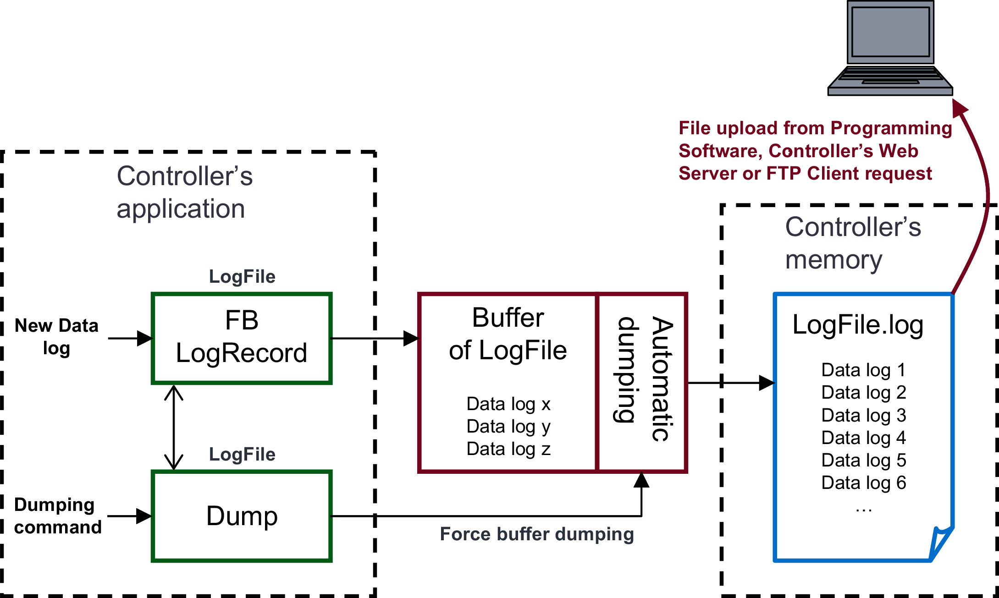

# Introduction to Data Logging

## Overview

You can monitor and analyze application data by examining the data log file (.log).



The figure illustrates an application that includes the LogRecord function block and the Dump method. The LogRecord function block writes data to a buffer, which then empties into the data log file (.log) located in the controller memory. Buffer dumping occurs automatically when the buffer is 80% full. Alternatively, you can manually force this process by executing the Dump method. As an FTP client, a PC can access this data log file when the controller functions as an FTP server. You can also upload the file using EcoStruxure Machine Expert, or the web server of the controller.

NOTE: Data logging is exclusively supported by controllers with file management functionality. Consult the *Programming Guide* specific to your controller to see if it supports file management. The software itself does not evaluate your controller for compatibility with data logging activities.

## **Sample Data Log File (.log)**

```
Entries in File: 8; Last Entry: 8;
```

```
18/06/2009;14:12:33;cycle: 1182;
```

```
18/06/2009;14:12:35;cycle: 1292;
```

```
18/06/2009;14:12:38;cycle: 1450;
```

```
18/06/2009;14:12:40;cycle: 1514;
```

```
18/06/2009;14:12:41;cycle: 1585;
```

```
18/06/2009;14:12:43;cycle: 1656;
```

```
18/06/2009;14:14:20;cycle: 6346;
```

```
18/06/2009;14:14:26;cycle: 6636;
```

## Implementation Procedure

First declare and configure the data log files in your application before starting to write your program.

EIO0000002938.02