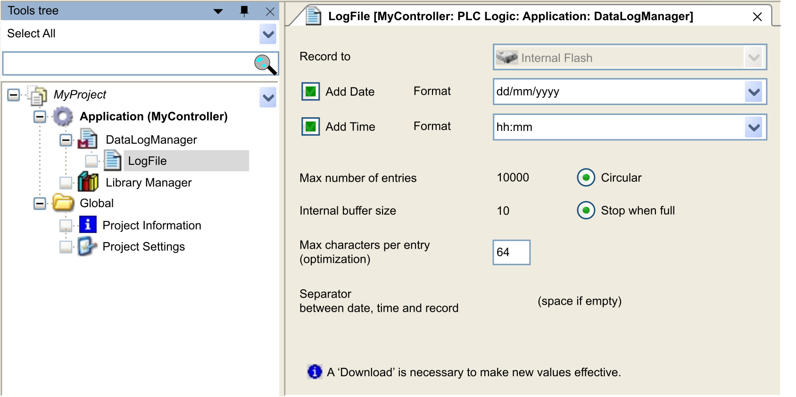

# Creating and Configuring the Data Log

## Adding a Data Log Manager

Add a data log manager to your application before configuring data logging:

| Step | Action |
| --- | --- |
| 1 | In the Tools tree, select the Application node, click the green plus sign and select Add other objects > DataLogManager....  **Result:** The Add Data Log Manager dialog box is displayed. |
| 2 | In the Add Data Log Manager dialog box, click Add.  **Result:** A DataLogManager node is displayed below the Application node. |
| 3 | Select the DataLogManager node, click the green plus sign, and select DataLog....  **Result:** The Add DataLog dialog box is displayed. |
| 4 | In the Data Logging File Name text box, enter a name for your data log file, and click Add.  **Result:** The data log file with the given name is displayed below the DataLogManager node, and the configuration editor opens in the editor view in the middle of the Logic Builder screen.  **Note:** The data log file name cannot be modified. |
| 5 | [Set the data log file parameters](#D-SE-0002167__D-SE-0002167.5). |
| 6 | Repeat steps 3 to 5 to create additional data log files. |

NOTE: For each data log file added to the DataLogManager, an instance of the function block LogRecord is created. A maximum number of 20 instances of the DataLog function block can be managed in an application.

## Configuration Editor

The configuration editor is displayed after you have added a data log file to your configuration:

## Configuration Parameters of the Data Log File

| Parameter | Description | |
| --- | --- | --- |
| Add Date | These options print the respective date or time for each record. For example, an instance associated with 10 June 2009 at 2:30 p.m. could be represented as `10/06/2009` or `06/10/2009` or `20090610` ... at `14:30` or `02:30:00 pm`, etc. | |
| Add Time |
| Max number of entries | This option sets the maximum number of records contained in the data log file.  Value range: 10...65536  Default value: 10000 | |
| Mode | Circular (default) | When the Max number of entries is reached, new records overwrite old records. The first line of the data log file indicates the present position of the last record and the rank of other records. The following cases are based on a file with a 10-record maximum:   * **Case 1:** `Entries in File: 8; Last Entry: 8`  **Meaning:** The number of entries in the file equals the value of `Last Entry`. The records are ranked from N°1 (the oldest) to N°8 (the most recent). * **Case 2:** `Entries in File: 10; Last Entry: 5`  **Meaning:** The number of entries in the file is greater than the value of `Last Entry`. The file is full, and a new record replaces the oldest one. The 10 records are ranked in this order (oldest to newest): 6, 7, 8, 9, 10, 1, 2, 3, 4, 5 |
| Stop when full | When the Max number of entries is reached, a new record attempt returns an error message. |
| Internal buffer size | Configure the size of the RAM buffer that stores the added records.  Value range: 1...value configured with Max number of entries  Default value: 10 | |
| Max characters per entry (optimization) | Set the maximum length of each entry.  Value range: 10...255  Default value: 64  The maximum length includes separators and optional date and time. Additional spaces are added at the end of the line to accommodate the number of defined characters. | |
| Separator between date, time and record | Define the character to be inserted between different fields in the data log. An additional separator is added after the record. | |
| NOTE: For each configured data log file, there is a LogRecord function block instance with the same name as this data log file is created. It handles the internal data and allows data logging management. | | |

EIO0000002938.02