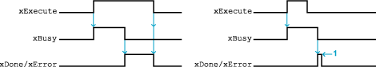
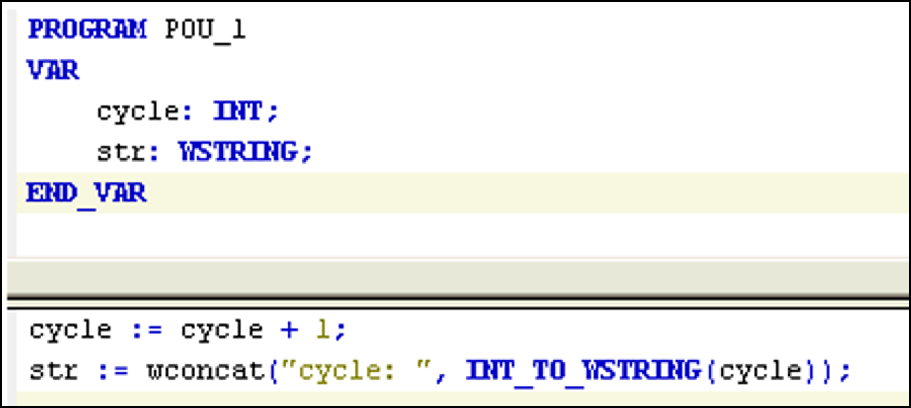

# General Information

## Overview

|  |  |
| --- | --- |
| Type: | Function block |
| Available as of: | V1.0.0.0 |

## Task

This function block is used for logging a UNICODE string in a specific data log file.

## Description

The LogRecord function block writes text string entries to the data log file. It stores the input string in an internal buffer. When 80% of the capacity of the buffer is full, the data is moved to the controller. To start the saving process programmatically, execute the Dump method.

When power is removed, you may lose the data in the internal buffer or increase the cycle time until the buffer is emptied.

| NOTICE | |
| --- | --- |
|  | LOSS OF DATA  * Do not remove power from the controller until all internal buffer information has been moved to the actual file system. * If the data being recorded is important to your application, configure the Internal buffer size parameter to 1.  Failure to follow these instructions can result in equipment damage. |

If the buffered data is important to your application, and you choose to have an internal buffer size greater than 1, implement an external means, such as a controller input, to signal the execution of the Dump method.

## Interface

| Input | Data type | Description |
| --- | --- | --- |
| xExecute | BOOL | The function is executed on the rising edge of this input.  **NOTE:** When xExecute is set to TRUE at the first task cycle in RUN after a cold or warm reset, the rising edge is not detected. |
| wsRecord | WSTRING | This user-specified UNICODE text string is written to the data log file.  NOTE: The [WSTRING](#D-SE-0002171__D-SE-0002594.5) type is available in the Standard64.lib library that is automatically inserted when the data log manager is added to the application. |

| Output | Data type | Description |
| --- | --- | --- |
| xDone | BOOL | This output is set to TRUE when the record is successfully saved to the internal buffer without error messages. |
| xBusy | BOOL | This output remains TRUE while LogRecord is busy (until the transfer to the buffer is complete). |
| xError | BOOL | This output is set to TRUE when an error is detected (for example, when the internal buffer is full). |
| eError | ERROR | This output contains the error code when xError is TRUE:   * NO\_ERROR * INIT\_ERROR * DUMP\_ERROR * BUFFER\_FULL\_ERROR * FILE\_FULL\_ERROR * DUMP\_INCOMPLETED * INPUT\_ERROR * FILE\_OPEN\_ERROR * FILE\_SETPOINTER\_ERROR * FILE\_WRITE\_ERROR * FILE\_CLOSE\_ERROR |

NOTE: If the record exceeds the configured length, it is truncated.

The xDone and xError outputs remain TRUE as long as xExecute is TRUE. When xExecute is set to FALSE before xDone or xError is set to TRUE (xBusy is still TRUE), one of each is set to TRUE when the function block is completed during one controller cycle so that the application detects this end:

**1** One cycle as `xExecute` is FALSE.

For each data log file, an instance of the LogRecord function block is created.

NOTE: Do not explicitly declare an instance of the function block because the instance is declared automatically. If you explicitly declare an instance of the function block, the 2 time variable declaration message is displayed () and the function block is rendered inoperable.

Add the function block to your POU and specify the appropriate data log file instance with Input Assistant (refer to [Adding the LogRecord Function Block](#D-SE-0002171__D-SE-0002730.4)).

## Properties of the Data Log

You can access the data log properties after you have configured the function block.

The LogRecord properties are additional variables (read only) automatically attached to the LogRecord instance that provide information about the data log file status:

| Variables | Data type | Description |
| --- | --- | --- |
| <Data Log File name>.NumberOfRecords | UDINT | Number of records in the data log file |
| <Data Log File name>.NumberOfBufferedRecords | UINT | Number of records in the buffer |
| <Data Log File name>.FileStatus | FILE\_STATUS | Status information about the data log file (FILE\_STATUS type):   * 0: OK * 1: FILE\_FULL * 2: NO\_WRITE\_ACCESS * 3: FILE\_NOT\_EXISTS |
| <Data Log File name>.DumpInProgress | BOOL | TRUE when the buffered records are being saved in the data log file. |

## Adding the LogRecord Function Block

Add the LogRecord function block to your project:

| Step | Action |
| --- | --- |
| 1 | To select a LogRecord function block in your POU, use the Input Assistant or directly type `LogRecord`:  In the Input Assistant dialog box, select the following options:   * Categories: Function Blocks * Items: {} SEDL > LogRecord  (With the option Structured view selected.) |
| 2 | Click OK or press ENTER.  **Result**: The LogRecord function block is saved to your project. |
| 3 | Select the appropriate data log file as LogRecord instance name from the Input Assistant or directly enter the data log file name. |
| 4 | Configure the inputs and outputs of the function block.  Refer to the [description of parameters](D-SE-0002171.html#D-SE-0002171__D-SE-0002171.3). |

NOTE: For the DataLogManager, a maximum number of 20 files is allowed in the *usr/log* directory. If the number of files is exceeded, the 21st instance of the LogRecord() function block is not executed and the error message INIT\_ERROR is displayed.

## Using LogRecord in Task with Short Interval

The LogRecord function block needs more than 15 interval cycles after the activation (with xExecute) to save a record to the logfile. Therefore, it is a good practice to use this function block within a task with a short interval:

| Task Type | Interval (ms) | Minimum Time Needed to Save Record |
| --- | --- | --- |
| cyclic | 20 | 300 ms |
| cyclic | 1 | 15 ms - preferred solution |
| event | - | 15 events - inefficient solution |

## Building a Wide String (WSTRING)

The wsRecord input of the LogRecord function block is of the type WSTRING (wide string). To build the log string, add the Standard64 library to your application and use wide string functions.

This figure indicates the creation of a sample WSTRING that includes a variable value:

EIO0000002938.02