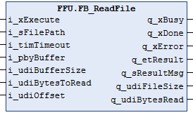

# FB\_ReadFile Functional Description

## Overview

|  |  |
| --- | --- |
| Type: | Function block |
| Available as of: | 1.8.3.0 |
| Inherits from: | - |
| Implements: | - |

## Functional Description

The function block FB\_ReadFile is used to read the content of a file located on the file system of the controller, or on the extended memory (for example, an SD memory card).

The following options for reading are supported when the buffer size is sufficient and the offset position is less than the file size:

* Reading the entire content of the file.
* Reading a dedicated number of bytes.
* Reading from a dedicated byte position in the file.

NOTE: The allocated buffer for read data is cleared before each read operation.

If one of the following conditions applies, a diagnostic message is reported by the function block even though data is read from the file:

* The buffer size is smaller than the file size: The content that fits the buffer size is read from the file.
* The value of the parameter BytesToRead is greater than the buffer size: The content that fits the buffer size is read.
* The sum of the parameter values BytesToRead and Offset is greater than the file size: The content from the offset position until the end of the file is read.

For further information, refer to [FB\_ReadFile Troubleshooting](FBReadFileTrouble-BD9D1D42.html).

## Interface

| Input | Data type | Description |
| --- | --- | --- |
| i\_xExecute | BOOL | A rising edge of this input starts the execution of the function block.  Also refer to the chapter [Behavior of Function Blocks with the Input i\_xExecute](i_xExecute-E1D1178E.html). |
| i\_sFilePath | STRING[255] | Path to the file to be read. |
| i\_timTimeout | TIME | Timeout for the read operation. After this time has elapsed, the operation is aborted.  Value range: 0...60 s  If the value is T#0s, the default value T#2s is applied. |
| i\_pbyBuffer | POINTER TO BYTE | Pointer to the buffer provided by the application where the read data is to be stored. |
| i\_udiBufferSize | UDINT | Specifies the size of the buffer in bytes.  NOTE: Use the arithmetic operator SIZEOF to retrieve the size of the variable the pointer i\_pbyBuffer points to. |
| i\_udiBytesToRead | UDINT | Specifies the number of bytes to be read from the file. The number of bytes that are read is limited by the buffer size.  NOTE: If the value is unassigned or 0, the buffer size is used as the maximum limit for bytes that are read. |
| i\_udiOffset | UDINT | Specifies the offset position to be read from. The value must not be greater than the size of the file. |

| Output | Data type | Description |
| --- | --- | --- |
| q\_xDone | BOOL | If this output is set to TRUE, the execution has been completed successfully. |
| q\_xBusy | BOOL | If this output is set to TRUE, the function block execution is in progress. |
| q\_xError | BOOL | If this output is set to TRUE, an error has been detected. For details, refer to q\_etResult and q\_etResultMsg. |
| q\_etResult | ET\_Result | Provides diagnostic and status information as a numeric value.  If q\_xBusy = TRUE, the value indicates the status.  If q\_xDone or q\_xError = TRUE, the value indicates the result. |
| q\_sResultMsg | STRING[80] | Provides additional diagnostic and status information as a text message. |
| q\_udiFileSize | UDINT | Provides the file size in bytes. |
| q\_udiBytesRead | UDINT | Provides the number of read bytes, stored in the assigned buffer. |

## Usage of Variables of Type POINTER TO … or REFERENCE TO …

The function block provides inputs and/or in/outputs of type POINTER TO… or REFERENCE TO…. With the use of such a pointer or reference, the function block accesses the addressed memory area.

NOTE: In case of an online change event, it may happen that memory areas are moved to new memory locations and, as a consequence, a pointer or reference becomes invalid. To help prevent errors associated with invalid pointers, variables of type POINTER TO… or REFERENCE TO… must be updated cyclically or at least at the beginning of the cycle in which they are used.

EIO0000002785.06