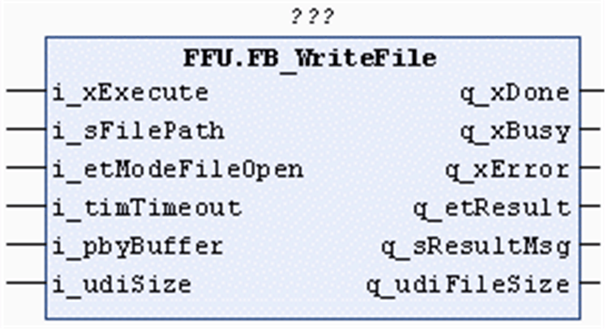

# FB\_WriteFile Functional Description

## Overview

|  |  |
| --- | --- |
| Type: | Function block |
| Available as of: | V1.2.0.3 |
| Inherits from: | - |
| Implements: | - |



## Functional Description

The function block FB\_WriteFile is used to open or to create a file on the file system of the controller, or on the extended memory (for example, an SD memory card), and to write specified content into it. For information on the file system, refer to the chapter *Flash Memory Organization* in the Programming Guide of your controller. The file format and the content to be written have no influence on the function block.

The value of the ET\_ModeFileOpen [enumeration](D-SE-0080736.html#D-SE-0080736) allows you to specify whether the data is to be appended to an existing file or whether a new file is to be created.

The content to be written into the file is provided by a pointer to the buffer in the application memory where the data is stored. The size of data is specified in bytes and must not exceed the size of the buffer.

## Interface

| Input | Data type | Description |
| --- | --- | --- |
| i\_xExecute | BOOL | The function block opens or creates the specified file and writes the specified content upon a rising edge of this input.  Also refer to the chapter [Behavior of Function Blocks with the Input i\_xExecute](i_xExecute-E1D1178E.html). |
| i\_sFilePath | STRING[255] | Path to the file. |
| i\_etModeFileOpen | ET\_ModeFileOpen | Specifies the mode for opening the file and the content to be written into the file. |
| i\_timTimeout | TIME | After this time has elapsed, the execution is canceled.  If the value is T#0s, the default value T#2s is applied. |
| i\_pbyBuffer | POINTER TO BYTE | Pointer to the buffer provided by the application. It contains the content that is to be written to the file. |
| i\_udiSize | UDINT | Specifies the number of bytes to write. The value must not exceed the size of the buffer. |

NOTE: To prevent memory access violations due to an invalid pointer, ensure that the pointer is properly initialized and bounded. Use the arithmetic operator SIZEOF in conjunction with the targeted buffer to determine the value for udiSize.

Example:

```
fbWriteFile.i_pbyBuffer := ADR(abyBuffer);
fbWriteFile.i_udiSize := SIZEOF(abyBuffer);
```

| Output | Data type | Description |
| --- | --- | --- |
| q\_xDone | BOOL | If this output is set to TRUE, the execution has been completed successfully. |
| q\_xBusy | BOOL | If this output is set to TRUE, the function block execution is in progress. |
| q\_xError | BOOL | If this output is set to TRUE, an error has been detected. For details, refer to q\_etResult and q\_etResultMsg. |
| q\_etResult | ET\_Result | Provides diagnostic and status information as a numeric value.  If q\_xBusy = TRUE, the value indicates the status.  If q\_xDone or q\_xError = TRUE, the value indicates the result. |
| q\_sResultMsg | STRING[80] | Provides additional diagnostic and status information as a text message. |
| q\_udiFileSize | UDINT | Provides the file size in bytes of the file recently processed. |

## Usage of Variables of Type POINTER TO … or REFERENCE TO …

The function block provides inputs and/or in/outputs of type POINTER TO… or REFERENCE TO…. With the use of such a pointer or reference, the function block accesses the addressed memory area.

NOTE: In case of an online change event, it may happen that memory areas are moved to new memory locations and, as a consequence, a pointer or reference becomes invalid. To help prevent errors associated with invalid pointers, variables of type POINTER TO… or REFERENCE TO… must be updated cyclically or at least at the beginning of the cycle in which they are used.

EIO0000002785.06