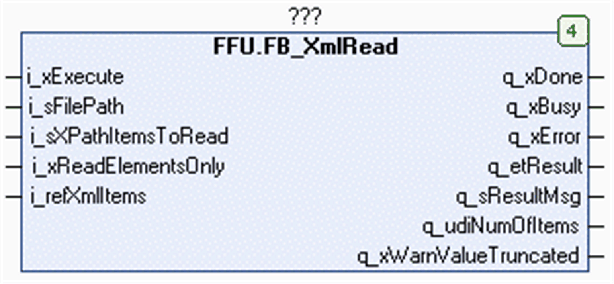

# FB\_XmlRead Functional Description

## Overview

|  |  |
| --- | --- |
| Type: | Function block |
| Available as of: | V1.0.8.0 |
| Inherits from: | - |
| Implements: | - |

## Functional Description

The function block FB\_XmlRead is used to read (parse) an XML file that is located on the file system of the controller, or on the extended memory (for example, an SD memory card). For information on the file system, refer to the chapter *Flash Memory Organization* in the Programming Guide of your controller.

The content of the XML file, XML elements together with their attributes and values, is stored in an array of type XmlItems in the application memory of the controller. You have to declare this array and assign it to the associated input i\_refXmlItems on the function block.

NOTE: At the beginning of each read operation, the content of this array is erased.

When executing the function block, the input i\_refXmlItems is stored internally for further use. In case an online change event is detected while the function block is executed (q\_xBusy = TRUE), the internally used variables are updated with the present value of the input.

NOTE: Do not reassign the i\_refXmlItems to another variable while the function block is executed.

The number of items (sum of elements and attributes) which can be stored in the array is specified by the parameter Gc\_udiXmlMaxNumOfItems in the [GPL](D-SE-0080752.html#D-SE-0080752__D-SE-0080752.7).

The array contains the fields of type STRING to store the names and the values of the elements and attributes. You can specify the length of these STRINGs by the global parameter Gc\_uiXmlLengthOfString. If a value to be read in the file exceeds the specified length, the original value is truncated. If at least one value has been truncated, this is indicated by the output q\_xWarnValueTruncated.

NOTE: The output q\_xWarnValueTruncated is valid only if the output q\_xDone is TRUE.

The hierarchical structure of the elements from the XML file is indicated by the parameter uiParentIndex for each item in the array of type XmlItems. For further information, refer to uiParentIndex  [*Example for Hierarchical Relations Indicated by uiParentIndex*](D-SE-0080739.html#D-SE-0080739__D-SE-0080739.6).

## Interface

| Input | Data type | Description |
| --- | --- | --- |
| i\_xExecute | BOOL | The function block executes the read operation with the specified XML file upon a rising edge of this input.  Also refer to the chapter [Behavior of Function Blocks with the Input i\_xExecute](i_xExecute-E1D1178E.html). |
| i\_sFilePath | STRING[255] | File path to the XML file that shall be read.  If a file name is specified without file extension, the function block adds the extension .xml. |
| i\_sXPathItemToRead | STRING[255] | XPath expression to address the elements which shall be read from the XML file.  Default value: '//\*' |
| i\_xReadElementsOnly | BOOL | If this input is TRUE, the element names and their values are read and stored to the application buffer.  If this input is FALSE, the attributes together with their values are also read and stored to the application buffer. |
| i\_refXmlItems | REFERENCE TO XmlItems | Buffer provided by the application to store the elements read from the specified XML file.  The buffer is erased with each execution of the function block. |

| Output | Data type | Description |
| --- | --- | --- |
| q\_xDone | BOOL | If this output is set to TRUE, the execution has been completed successfully. |
| q\_xBusy | BOOL | If this output is set to TRUE, the function block execution is in progress. |
| q\_xError | BOOL | If this output is set to TRUE, an error has been detected. For details, refer to q\_etResult and q\_etResultMsg. |
| q\_etResult | ET\_Result | Provides diagnostic and status information as a numeric value.  If q\_xBusy = TRUE, the value indicates the status.  If q\_xDone or q\_xError = TRUE, the value indicates the result. |
| q\_sResultMsg | STRING[80] | Provides additional diagnostic and status information as a text message. |
| q\_udiNumOfItemsRead | UDINT | Indicates the total number of elements and attributes read from the XML file. |
| q\_xWarnValueTruncated | BOOL | If this output is set to TRUE, at least one value has been truncated.  NOTE: The output is updated along with q\_xDone. |

For more information about the signal behavior of the basic inputs and outputs, refer to the chapter [Behavior of Function Blocks with the Input i\_xExecute](i_xExecute-E1D1178E.html).

## Usage of Variables of Type POINTER TO … or REFERENCE TO …

The function block provides inputs and/or in/outputs of type POINTER TO… or REFERENCE TO…. With the use of such a pointer or reference, the function block accesses the addressed memory area.

NOTE: In case of an online change event, it may happen that memory areas are moved to new memory locations and, as a consequence, a pointer or reference becomes invalid. To help prevent errors associated with invalid pointers, variables of type POINTER TO… or REFERENCE TO… must be updated cyclically or at least at the beginning of the cycle in which they are used.

## XPath Expressions Defining the Content to Be Read

To be able to read a single element or a group of elements from the XML file, use the syntax of the XPath (XML Path) language. The content to be read is specified by the input i\_XpathItemToRead

NOTE: The function block FB\_XmlRead supports a subset of the features provided with XPath expressions.

The table lists the supported XPath expressions:

| XPath expression | Description |
| --- | --- |
| `//*` | Selects all elements in the document. |
| `/` | Indicates an absolute path to an element. |
| `/…/child::*` | Selects all child elements of the node. |
| `/…/descendant::*` | Selects all descendant elements of the node. |
| `/…/<elementname>` | Selects all elements with the specified name of the node. |
| `/…/<elementname>[<n>]` | Selects the nth element with the specified name of the node. |
| `/…/<elementname>[@<attribute>]` | Selects all elements with the specified name and the specified attribute of the node. |
| `/…/<elementname>[@<attribute>=<value>]` | Selects all elements with the specified name and the specified attribute and value of the node. |

NOTE: The predicates, that are the expressions within square brackets `[]`, can be followed by a slash `/` together with an element name to address the next child element.

Example: `/…/<elementname>[<n>]/<elementname>`

EIO0000002785.06