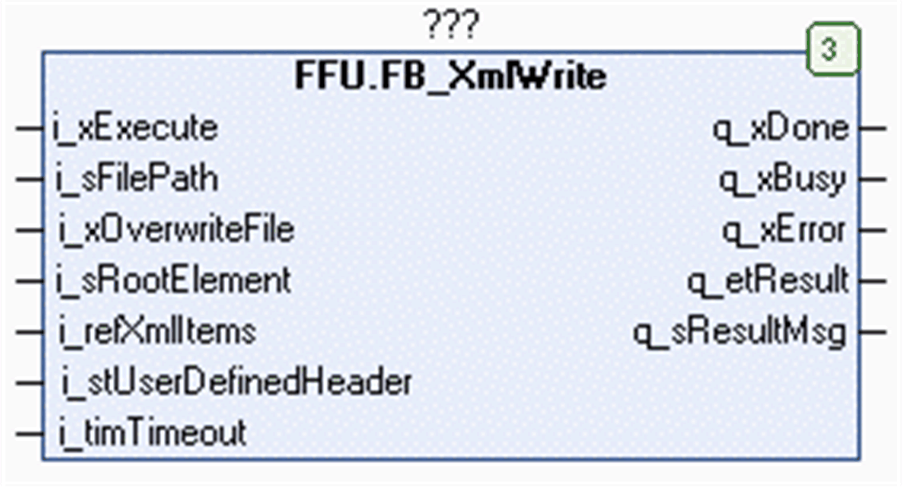

# FB\_XmlWrite Functional Description

## Overview

|  |  |
| --- | --- |
| Type: | Function block |
| Available as of: | V1.0.8.0 |
| Inherits from: | - |
| Implements: | - |

## Functional Description

The function block FB\_XmlWrite is used to create or overwrite an XML file on the file system of the controller, or on the extended memory (for example, an SD memory card). For information on the file system, refer to the chapter *Flash Memory Organization* in the Programming Guide of your controller.

When executing the function block, the input i\_refXmlItems is stored internally for further use. In case an online change event is detected while the function block is executed (q\_xBusy = TRUE), the internally used variables are updated with the present value of the input.

NOTE: Do not reassign the i\_refXmlItems to another variable while the function block is executed.

After the file has been created, the elements provided in the array of type XmlItems in the application memory of the controller are written into it.

The character code `LF (0A hex)` is used as line break in the created file.

The prolog `<?xml version="1.0" encoding="ASCII"?>` is inserted as first line of each file that is created by the function block.

After the prolog, the XML elements that are provided in the array of type XmlItems, including their attributes and their values, are written to the file. The structure or the nesting of the elements is specified by the parameter uiParentIndex which is part of the structure ST\_XmlItem. For further information, refer to uiParentIndex  [*Example for Hierarchical Relations Indicated by uiParentIndex*](D-SE-0080739.html#D-SE-0080739__D-SE-0080739.6).

The function block FB\_XmlWrite provides the input i\_sRootElement to specify a root element. This is useful in case the array providing the elements contains no root element or more than one root element:

* The use case without root element is allowed if the values of the uiParentIndex parameters in the array are all 0.
* The use case with more than one root element can occur if a group of child elements has been read from a file before the right operation and the modified data is to be written to a new file.

Apart from these two exceptional cases, the defined structure of the elements must be consistent. Otherwise the function block cancels writing the file and the file is discarded.

For items of type attribute, the parameter uiParentIndex does not have an effect. Attributes are assigned to the next upper item of type element in the array.

You can define additional content using the structure i\_stUserDefinedHeader. The content is written between the prolog and the first element to the XML file. This additional content could be, for example, a comment (XML syntax).

The input i\_xOverwriteFile allows you to define whether an existing file will be overwritten. If the input is FALSE and the specified file already exists, the execution of the function block is canceled and an error is indicated.

## Interface

| Input | Data type | Description |
| --- | --- | --- |
| i\_xExecute | BOOL | The function block creates the specified XML file and writes the specified content into it upon a rising edge of this input.  Also refer to the chapter [Behavior of Function Blocks with the Input i\_xExecute](i_xExecute-E1D1178E.html). |
| i\_sFilePath | STRING[255] | File path to the XML file.  If a file name is specified without file extension, the function block adds the extension .xml. |
| i\_xOverwriteFile | BOOL | Specifies whether an existing file is to be overwritten. Set this input to TRUE to allow the replacement of an existing file. |
| i\_sRootElement | STRING[GPL.Gc\_uiXmlLengthOfString] | Root element which is created if the array of structure XmlElements contains more than one root element. |
| i\_stUserDefinedHeader | ST\_XmlUserDefinedHeader | The structure contains user-defined content that is to be written at the beginning of the newly created XML file. |
| i\_timTimeout | TIME | After this time has elapsed, the execution is canceled.  If the value is T#0s, the default value T#2s is applied. |
| i\_refXmlItems | REFERENCE TO XmlItems | Buffer provided by the application that contains the content to be written to the XML file. |

| Output | Data type | Description |
| --- | --- | --- |
| q\_xDone | BOOL | If this output is set to TRUE, the execution has been completed successfully. |
| q\_xBusy | BOOL | If this output is set to TRUE, the function block execution is in progress. |
| q\_xError | BOOL | If this output is set to TRUE, an error has been detected. For details, refer to q\_etResult and q\_etResultMsg. |
| q\_etResult | ET\_Result | Provides diagnostic and status information as a numeric value.  If q\_xBusy = TRUE, the value indicates the status.  If q\_xDone or q\_xError = TRUE, the value indicates the result. |
| q\_sResultMsg | STRING[80] | Provides additional diagnostic and status information as a text message. |

## Usage of Variables of Type POINTER TO … or REFERENCE TO …

The function block provides inputs and/or in/outputs of type POINTER TO… or REFERENCE TO…. With the use of such a pointer or reference, the function block accesses the addressed memory area.

NOTE: In case of an online change event, it may happen that memory areas are moved to new memory locations and, as a consequence, a pointer or reference becomes invalid. To help prevent errors associated with invalid pointers, variables of type POINTER TO… or REFERENCE TO… must be updated cyclically or at least at the beginning of the cycle in which they are used.

EIO0000002785.06