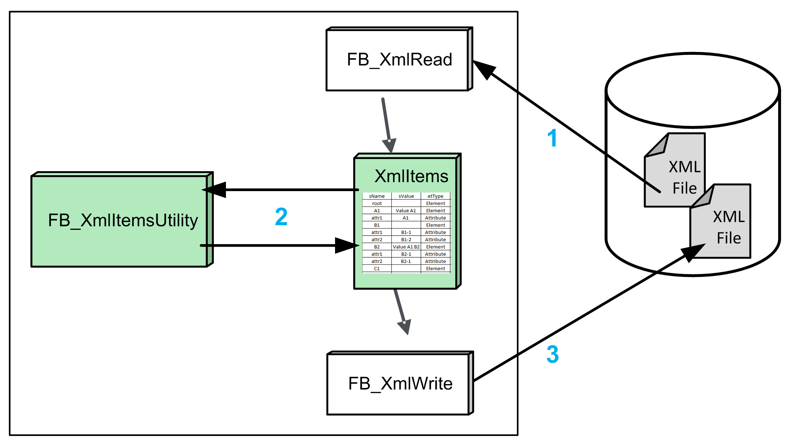

# FB\_XmlItemsUtility Functional Description

## Overview

|  |  |
| --- | --- |
| Type: | Function block |
| Available as of: | V1.3.2.0 |
| Inherits from: | - |
| Implements: | - |

## Functional Description

The function block FB\_XmlItemsUtility is used to process the data contained in an array of type XmlItems.

The function block provides several methods and properties for processing the data in the array.

Using the methods and properties allows you to parse the array to get or to modify the values from the single XML items. In addition, you can add further elements and attributes.

| Item | Description |
| --- | --- |
| 1 | The function block FB\_XmlRead is used to read the content from an XML file. The data is stored in an array of type XmlItems. |
| 2 | The function block FB\_XmlItemsUtility supports the following features:   * Reading of single values * Modifying of single values * Modifying an existing XML structure |
| 3 | The function block FB\_XmlWrite is used to create a new XML file based on the data from the array of type XmlItems. An existing file can be overwritten. |

Before you start processing data in the array, you must call either the method SelectElement or InitializeXmlItems. After a successful execution of one of the methods, the required link to the array is created and the desired base element for further operations is selected.

The function block does not provide parameters but methods and properties. The instance of the function block is used exclusively for holding the local variables which are accessed during the sequential processing of the associated methods or properties. Therefore, it is not required to call the function block in the application code.

EIO0000002785.06