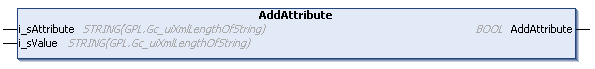

# AddAttribute (Method)

## Overview

|  |  |
| --- | --- |
| Type: | Method |
| Available as of: | V1.3.2.0 |

## Functional Description

This method is used to add an attribute to the selected element.

The return value of type BOOL indicates TRUE if the attribute was added successfully.

A call of this method returns either Ok, NoElementSelected, AttributeAlreadyExistsForSelectedElement, InvalidInput, or BufferFull. Use the property Result to obtain the result of the method.

## Interface

| Input | Data type | Description |
| --- | --- | --- |
| i\_sAttribute | STRING [Gc\_uiXmlLengthOfString] | Name of the attribute. |
| i\_sValue | STRING [Gc\_uiXmlLengthOfString] | Value of the attribute. |

EIO0000002785.06