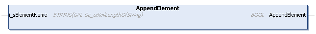

# AppendElement (Method)

## Overview

|  |  |
| --- | --- |
| Type: | Method |
| Available as of: | V1.3.2.0 |



## Functional Description

This method is used to append a new element at the same level of the presently selected element. After the method was executed successfully, the new element is selected for further operations.

The return value of type BOOL indicates TRUE if a new element was appended successfully.

A call of this method returns either Ok, WrongLayerToAppendElement, InvalidInput, NoElementSelected, or BufferFull. Use the property Result to obtain the result of the method.

## Interface

| Input | Data type | Description |
| --- | --- | --- |
| i\_sElementName | STRING [Gc\_uiXmlLengthOfString] | Name of the element to be appended. |

## Example

|  |  |
| --- | --- |
| Code:   ``` fbXmlItems.InitializeXmlItems('root', astXmlData); fbXmlItems.AddSubElement('A1'); fbXmlItems.AddAttribute('a1', 'A1-1');  fbXmlItems.AppendElement('A2'); ```   Result:  The resulting XML file is displayed on the right-hand side. |  |

EIO0000002785.06