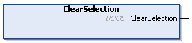

# ClearSelection (Method)

## Overview

|  |  |
| --- | --- |
| Type: | Method |
| Available as of: | V1.3.2.0 |

## Functional Description

This method is used to clear the present selection.

The return value of type BOOL indicates TRUE, no matter if an element was selected before or not.

A call of this method returns Ok.

EIO0000002785.06