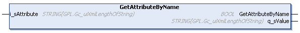

# GetAttributeByName (Method)

## Overview

|  |  |
| --- | --- |
| Type: | Method |
| Available as of: | V1.3.2.0 |



## Functional Description

This method is used to read the value of the specified attribute from the selected element.

The return value of type BOOL indicates TRUE if the attribute was found.

A call of this method returns either Ok, NoElementSelected, InvalidInput, or AttributeNotFound. Use the property Result to obtain the result of the method.

If the q\_sValue is a null string either no element is selected, the attribute was not found, or the attribute has no value. The value on q\_sValue is valid only if the return value of the method is TRUE.

## Interface

| Input | Data type | Description |
| --- | --- | --- |
| i\_sAttribute | STRING [Gc\_uiXmlLengthOfString] | Name of the attribute. |

| Output | Data type | Description |
| --- | --- | --- |
| q\_sValue | STRING [Gc\_uiXmlLengthOfString] | Value of the specified attribute. |

## Example

Precondition: The XML file (illustrated below) was read using the FB\_XmlRead and the content is stored in the array astXmlFile of type XmlItems.

|  |  |
| --- | --- |
| Code:   ``` fbXmlItems.SelectElement('/root/A1', astXmlData); IF fbXmlItems.GetAttributeByName('a1', sValue) THEN   // do something with sValue END_IF ```   Result:  The variable sValue provides the value 'A1-1'. |  |

EIO0000002785.06