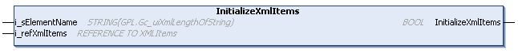

# InitializeXmlItems (Method)

## Overview

|  |  |
| --- | --- |
| Type: | Method |
| Available as of: | V1.3.2.0 |



## Functional Description

This method is used to initialize the linked array of type XmlItems. During initialization, the content of the array is erased and the specified element is created as the root element. After the method is executed successfully, the created element is selected for further operations.

The return value of type BOOL indicates TRUE if the array was initialized successfully.

A call of this method returns either Ok, or InvalidInput. Use the property Result to obtain the result of the method.

## Interface

| Input | Data type | Description |
| --- | --- | --- |
| i\_sElementName | STRING [Gc\_uiXmlLengthOfString] | Name of the element to be created as root. |
| i\_refXmlItems | REFERENCE TO XMLItems | Array provided by the application which contains the elements and attributes read from or to be written to an XML file. |

## Example

|  |  |
| --- | --- |
| Code:   ``` fbXmlItems.InitializeXmlItems('root', astXmlData); ```   Result:  The resulting XML file only contains the element 'root'. |  |

EIO0000002785.06