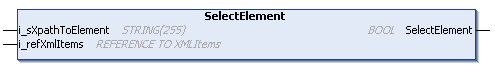

# SelectElement (Method)

## Overview

|  |  |
| --- | --- |
| Type: | Method |
| Available as of: | V1.3.2.0 |



## Functional Description

This method is used to select the specified element from the array of type XmlItems. Based on the selected element, further methods can be executed.

The element is specified using an XPath expression. If the XPath expression matches several elements, the first matching element is selected. If a null string is assigned to the input i\_sXpathToElement, the root element becomes selected.

On each call, the search of the specified element is started from the beginning of the array. That is, using the same XPath expression always results in the same element being selected.

The return value of type BOOL indicates TRUE if an element was successfully selected.

A call of this method returns either Ok, XPathExpressionInvalid, or ElementNotFound. Use the property Result to obtain the result of the method.

## Interface

| Input | Data type | Description |
| --- | --- | --- |
| i\_sXpathToElement | STRING[255] | XPath expression to specify the element to be selected. If a null string is assigned, the root element becomes selected. |
| i\_refXmlItems | REFERENCE TO XmlItems | Array provided by the application which contains the elements and attributes read from or to be written to an XML file. |

## XPath Expressions

Use the syntax of the XPath (XML Path) language to specify the element to be selected.

The table lists the supported XPath expressions:

| XPath expression | Description |
| --- | --- |
| `/…/<``elementname``>` | Selects the first element matching the specified path. |
| `/…/<``elementname``>[<n>]` | Selects the nth element matching the specified path. |
| `/…/<``elementname``>[@<``attribute``>]` | Selects the first element matching the specified path that has the specified attribute. |
| `/…/<``elementname``>[@<``attribute``>=<``value``>]` | Selects the first element matching the specified path that has the specified attribute and value. |

The predicates (the expressions within square brackets `[]`) can be followed by a slash `/` together with an element name to address the next child element.

Example: `/…/<elementname>[<n>]/<elementname>`

## Example

Precondition: The XML file (illustrated below) was read using the FB\_XmlRead and the content is stored in the array astXmlFile of type XmlItems.

|  |  |
| --- | --- |
| Code:   ``` fbXmlItems.SelectElement('/root/A1', astXmlData); ```   Result:  The element A1 is selected. |  |

EIO0000002785.06