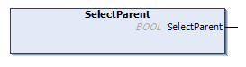

# SelectParent (Method)

## Overview

|  |  |
| --- | --- |
| Type: | Method |
| Available as of: | V1.3.2.0 |



## Functional Description

This method is used to select the parent element of the presently selected element.

The return value of type BOOL indicates TRUE if an element was successfully selected.

A call of this method returns either Ok, NoElementSelected, or ElementNotFound. Use the property Result to obtain the result of the method.

The method has no inputs.

## Example

Precondition: The XML file (illustrated below) was read using the FB\_XmlRead and the content is stored in the array astXmlFile of type XmlItems.

|  |  |
| --- | --- |
| Code:   ``` fbXmlItems.SelectElement('/root/A1'); fbXmlItems.SelectFirstChild(); fbXmlItems.SelectNext(); fbXmlItems.SelectFirstChild(); // do something with element C1; fbXmlItems.SelectParent(); ```   Result:  The element B2 is selected. |  |

EIO0000002785.06