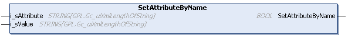

# SetAttributeByName (Method)

## Overview

|  |  |
| --- | --- |
| Type: | Method |
| Available as of: | V1.3.2.0 |

## Functional Description

This method is used to set the value of the specified attribute for the selected element.

The return value of type BOOL indicates TRUE if the attribute was found and the specified value was set.

A call of this method returns either Ok, NoElementSelected, InvalidInput, or AttributeNotFound. Use the property Result to obtain the result of the method.

## Interface

| Input | Data type | Description |
| --- | --- | --- |
| i\_sAttribute | STRING [Gc\_uiXmlLengthOfString] | Name of the attribute. |
| i\_sValue | STRING [Gc\_uiXmlLengthOfString] | New value of the attribute. |

EIO0000002785.06