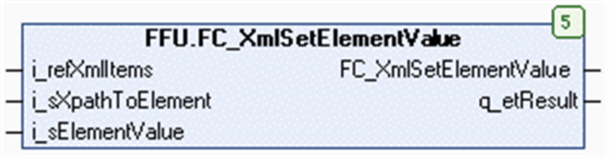

# FC\_XmlSetElementValue Functional Description

## Overview

|  |  |
| --- | --- |
| Type: | Function block |
| Available as of: | V1.0.8.0 |
| Inherits from: | - |
| Implements: | - |

## Functional Description

The function FC\_XmlSetElementValue is used to modify the value of the specified XML element from the buffer of type XmlItems.

The return value is TRUE if the function has been executed successfully. If the return value is FALSE, evaluate the output q\_etResult.

Consider the use of the function block FB\_XmlItemsUtility rather than this function. It provides additional features to modify data in the array of type XmlItems.

## Interface

| Input | Data type | Description |
| --- | --- | --- |
| i\_refXmlItems | REFERENCE TO XmlItems | Buffer provided by the application which contains the elements and attributes read from or to be written to an XML file. |
| i\_sXpathToElement | STRING[255] | XPath expression to specify the element that is to be read. |
| i\_sElementValue | STRING[Gc\_uiXmlLengthOfString] | The value to be set for the specified element. |

| Output | Data type | Description |
| --- | --- | --- |
| q\_etResult | ET\_Result | Provides diagnostic information as a numeric value. |

## XPath Expressions

Use the syntax of the XPath (XML Path) language to specify the element to be selected.

The table lists the supported XPath expressions:

| XPath expression | Description |
| --- | --- |
| `/…/<``elementname``>` | Selects the first element matching the specified path. |
| `/…/<``elementname``>[<n>]` | Selects the nth element matching the specified path. |
| `/…/<``elementname``>[@<``attribute``>]` | Selects the first element matching the specified path that has the specified attribute. |
| `/…/<``elementname``>[@<``attribute``>=<``value``>]` | Selects the first element matching the specified path that has the specified attribute and value. |

The predicates (the expressions within square brackets `[]`) can be followed by a slash `/` together with an element name to address the next child element.

Example: `/…/<elementname>[<n>]/<elementname>`

EIO0000002785.06