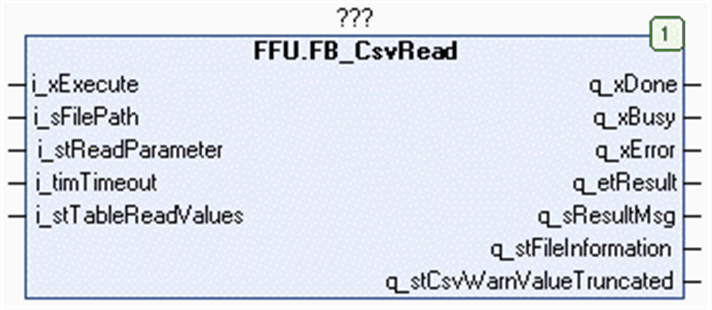

# FB\_CsvRead Functional Description

## Overview

|  |  |
| --- | --- |
| Type: | Function block |
| Available as of: | V1.0.8.0 |
| Inherits from: | - |
| Implements: | - |

## Functional Description

The function block FB\_CsvRead is used to read a CSV file located on the file system of the controller or on the extended memory (for example, an SD memory card). For information on the file system, refer to the chapter *Flash Memory Organization* in the Programming Guide of your controller.

The CSV file to read contains a number of values (columns) which are arranged in single records (rows). The values are separated by a specific delimiter. The records are separated by a line break.

Based on the specified character code for the delimiter, the function block identifies the individual values while reading the content of the file. The character code for the line break depends on the operating system where the file has been created. The function block supports the three most commonly used line break character codes (ASCII). It detects the line break character used while reading the content of the file.

The following line break characters (ASCII) are supported:

* `CRLF (0D0A hex)`: Used on operating systems such as Windows and MS-DOS.
* `LF (0A hex)`: Used on operating systems such as Unix, Linux, Mac OS X, and Android.

* `CR (0D hex)`: Used on operating systems such as Mac OS X version 9 or earlier.

The values read from the specified file are stored in the read buffer provided by the application in variables of type STRING. Declare the read buffer in the application as a two-dimensional ARRAY of type STRING. Use the input i\_stTableReadValues to provide the dimensions of the array and the pointer to that array to the function block. For further information, refer to the structure ST\_CsvTable.

When executing the function block, the input i\_stTableReadValues.pbyTable is stored internally for further use. In case an online change event is detected while the function block is executed (q\_xBusy = TRUE), the internally used variables are updated with the present value of the input.

NOTE: Do not reassign the i\_stTableReadValues.pbyTable to a different memory area while the function block is executed.

The file to be read must contain only ASCII characters to help ensure the correct rendition of the content of the file in the application. Files can contain a byte order mark (BOM) at the beginning which indicates the encoding of the processed file. ASCII-encoded files do not contain a BOM. The function block verifies the specified file for specific BOMs.

In case the file contains one of the following BOMs, the execution of the function block is canceled and an error is indicated:

`FE FF hex`, `FF EF hex`, or `EF BB BF hex`

Use the input i\_stReadParameter to determine the amount of data to be read. You can read the entire content of the file. You can also select a single record (row), a single column, or a single value to be read. Further, you can select to read only the file information which is provided by the output q\_stFileInformation.

NOTE: The function erases the array before read operation.

## Interface

| Input | Data type | Description |
| --- | --- | --- |
| i\_xExecute | BOOL | The function block executes the read operation with the specified CSV file upon a rising edge of this input.  Also refer to the chapter [Behavior of Function Blocks with the Input i\_xExecute](i_xExecute-E1D1178E.html). |
| i\_sFilePath | STRING[255] | File path to the CSV file.  If a file name is specified without file extension, the function block adds the extension .csv. |
| i\_stReadParameter | ST\_CsvReadParameter | Specifies the content to be read from the file.  Refer to ST\_CsvReadParameter. |
| i\_timTimeout | TIME | After this time has elapsed, the execution is canceled.  If the value is T#0s, the default value T#2s is applied. |
| i\_stTableReadValues | ST\_CsvTable | Structure to pass the buffer provided by the application to the function block (refer to the ST\_CsvTable [structure](D-SE-0080741.html#D-SE-0080741)). |

| Output | Data type | Description |
| --- | --- | --- |
| q\_xDone | BOOL | If this output is set to TRUE, the execution has been completed successfully. |
| q\_xBusy | BOOL | If this output is set to TRUE, the function block execution is in progress. |
| q\_xError | BOOL | If this output is set to TRUE, an error has been detected. For details, refer to q\_etResult and q\_etResultMsg. |
| q\_etResult | ET\_Result | Provides diagnostic and status information as a numeric value.  If q\_xBusy = TRUE, the value indicates the status.  If q\_xDone or q\_xError = TRUE, the value indicates the result. |
| q\_sResultMsg | STRING[80] | Provides additional diagnostic and status information as a text message. |
| q\_stFileInformation | ST\_CsvFileInfo | The structure contains information about the last file that has been processed |
| q\_stWarnValueTruncated | ST\_CsvWarnValueTruncated | Provides information about the first value that has been truncated, if available.  NOTE: The output is updated along with q\_xDone. |

For more information about the signal behavior of the basic inputs and outputs, refer to the chapter [Behavior of Function Blocks with the Input i\_xExecute](i_xExecute-E1D1178E.html).

## Usage of Variables of Type POINTER TO … or REFERENCE TO …

The function block provides inputs and/or in/outputs of type POINTER TO… or REFERENCE TO…. With the use of such a pointer or reference, the function block accesses the addressed memory area.

NOTE: In case of an online change event, it may happen that memory areas are moved to new memory locations and, as a consequence, a pointer or reference becomes invalid. To help prevent errors associated with invalid pointers, variables of type POINTER TO… or REFERENCE TO… must be updated cyclically or at least at the beginning of the cycle in which they are used.

EIO0000002785.06