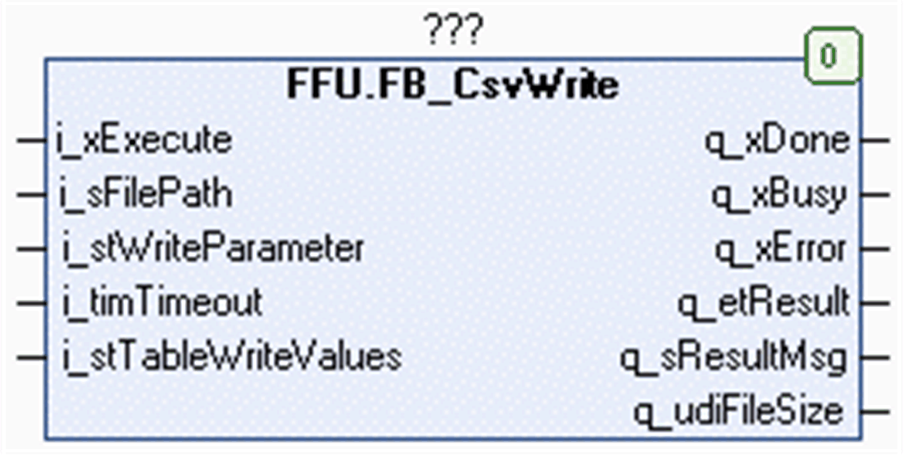

# FB\_CsvWrite Functional Description

## Overview

|  |  |
| --- | --- |
| Type: | Function block |
| Available as of: | V1.0.8.0 |
| Inherits from: | - |
| Implements: | - |

## Functional Description

The function block FB\_CsvWrite is used to write values to a CSV file located on the file system of the controller or on the extended memory (for example, an SD memory card). It can also create a new file. For information on the file system, refer to the chapter *Flash Memory Organization* in the Programming Guide of your controller.

The data to be written to the file is stored in the buffer provided by the application as variables of type STRING. Declare the buffer in the application as a two-dimensional ARRAY of type STRING. Use the input i\_stTableWriteValues to provide the dimensions of the array and the pointer to that array to the function block. For further information, refer to the structure ST\_CsvTable.

When executing the function block, the input i\_stTableReadValues.pbyTable is stored internally for further use. In case an online change event is detected while the function block is executed (q\_xBusy = TRUE), the internally used variables are updated with the present value of the input.

NOTE: Do not reassign the i\_stTableReadValues.pbyTable to a different memory area while the function block is executed.

The two-dimensional array represents the table structure consisting of rows and columns. Each row represents a record. The number of columns represents the maximum number of values one record can have.

The input i\_stWriteParameter provides the parameter to control the write operation. Use the parameter sDelimiter to specify the character code for the delimiter that is inserted to separate the individual values of the file. The value of the parameter etModeFileOpen allows you to specify whether the data is to be appended to an existing file or whether a new file is to be created. Use the parameters uiNumOfRows and uiNumOfColumns to specify the amount of data to be written.

The character code LF (0A hex) is inserted to provoke a line break between two records.

## Interface

| Input | Data type | Description |
| --- | --- | --- |
| i\_xExecute | BOOL | The function block opens or creates the specified CSV file and writes the specified content into it upon a rising edge of this input. |
| i\_sFilePath | STRING[255] | File path to the CSV file.  If a file name is specified without file extension, the function block adds the extension .csv. |
| i\_stWriteParameter | ST\_WriteParameter | Specifies the mode for opening the CSV file and the content to be written into the file. |
| i\_timTimeout | TIME | After this time has elapsed, the execution is canceled.  If the value is T#0s, the default value T#2s is applied. |
| i\_stTableWriteValues | ST\_CsvTable | Structure to pass the buffer provided by the application to the function block (refer to the ST\_CsvTable [structure](D-SE-0080741.html#D-SE-0080741)). |

| Output | Data type | Description |
| --- | --- | --- |
| q\_xDone | BOOL | If this output is set to TRUE, the execution has been completed successfully. |
| q\_xBusy | BOOL | If this output is set to TRUE, the function block execution is in progress. |
| q\_xError | BOOL | If this output is set to TRUE, an error has been detected. For details, refer to q\_etResult and q\_etResultMsg. |
| q\_etResult | ET\_Result | Provides diagnostic and status information as a numeric value.  If q\_xBusy = TRUE, the value indicates the status.  If q\_xDone or q\_xError = TRUE, the value indicates the result. |
| q\_sResultMsg | STRING[80] | Provides additional diagnostic and status information as a text message. |
| q\_udiFileSize | UDINT | Provides the file size in bytes of the file recently processed. |

## Usage of Variables of Type POINTER TO … or REFERENCE TO …

The function block provides inputs and/or in/outputs of type POINTER TO… or REFERENCE TO…. With the use of such a pointer or reference, the function block accesses the addressed memory area.

NOTE: In case of an online change event, it may happen that memory areas are moved to new memory locations and, as a consequence, a pointer or reference becomes invalid. To help prevent errors associated with invalid pointers, variables of type POINTER TO… or REFERENCE TO… must be updated cyclically or at least at the beginning of the cycle in which they are used.

EIO0000002785.06