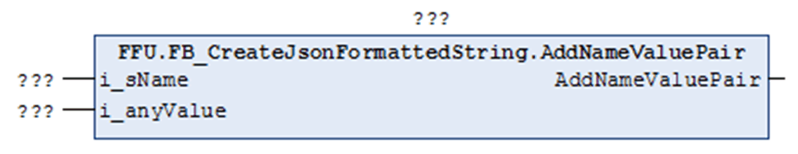

# AddNameValuePair (Method)

## Overview

|  |  |
| --- | --- |
| Type: | Method |
| Available as of: | 1.2.3.0 |



## Functional Description

Adds a name/value pair to the STRING that is being processed. The format of the value added to the STRING depends on the data type of the variable assigned to the input i\_anyValue. The assigned value is converted, if required, to an ASCII STRING and added in the suitable format to the STRING that is being processed.

In contrast to the Methods AddNameValuePair<data type> which support only one specific data type for the value, this single method supports several data types for the input i\_anyValue.

Variables of data type BOOL, STRING, INT, UINT, DINT, UDINT, BYTE, WORD, DWORD, LWORD, REAL, LREAL, SINT, USINT, LINT, ULINT, TIME, LTIME, DATE\_AND\_TIME, DATE, and TOD are supported for the input `i_anyValue`.

The return value is TRUE if the function was executed successfully. Evaluate the property `Result`, in case the return value is FALSE.

Unsuccessful execution of the method can have the following causes:

| Possible Cause | Effect |
| --- | --- |
| The maximum length of the present STRING is reached. | The STRING remains unchanged. |
| The data type (for example ARRAY or WSTRING) of the variable assigned to i\_anyValue is not supported. | The STRING remains unchanged. |

## Interface

| Input | Data type | Description |
| --- | --- | --- |
| i\_sName | STRING (`GPL.Gc_uiJsonMaxLengthOfName`) | Specifies the name of the name/value pair to be added.  The quotation marks surrounding the `<name>` must not be specified explicitly, they are implicitly added by the method. |
| i\_anyValue | ANY\* | Specifies the value to be added. |
| **(\*)** Supported data types are: BOOL, STRING, INT, UINT, DINT, UDINT, BYTE, WORD, DWORD, LWORD, REAL, LREAL, SINT, USINT, LINT, ULINT, TIME, LTIME, DATE\_AND\_TIME, DATE, and TOD. | | |

## Example

Calling the method AddNameValuePair adds the text marked in bold in the example to the STRING:

```
{"Key":1,"<name>":<value>}
```

`<name>` corresponds to the value specified with the input i\_sName of the method.

`<value>` corresponds to the value specified with the input i\_anyValue of the method.

EIO0000002785.06