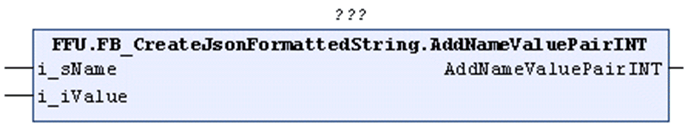

# AddNameValuePair<data type> (Method)

## Overview

This section provides a generic description for the following methods:

* AddNameValuePairINT
* AddNameValuePairDINT
* AddNameValuePairUDINT
* AddNameValuePairREAL
* AddNameValuePairSTRING
* AddNameValuePairBOOL

|  |  |
| --- | --- |
| Type: | Method |
| Available as of: | V1.2.0.3 |

As an example, the method AddNameValuePairINT is illustrated in the following figure:



## Functional Description

Adds a name/value pair to the STRING that is being processed with the value being of the data type that is indicated in the name of the method:

* INT = INTEGER
* DINT = DOUBLE INTEGER
* UDINT = UNSIGNED DOUBLE INTEGER
* REAL = floating point value as per IEC data type REAL
* STRING = STRING
* BOOL = BOOL

The assigned value is converted, if required, to an ASCII STRING and added in the suitable format to the STRING that is being processed.

The return value is TRUE if the function was executed successfully. Evaluate the property `Result`, in case the return value is FALSE.

Unsuccessful execution of the method can have the following causes:

| Possible Cause | Effect |
| --- | --- |
| The maximum length of the present STRING is reached. | The STRING remains unchanged. |

## Interface

| Input | Data type | Description |
| --- | --- | --- |
| i\_sName | STRING(`GPL.Gc_uiJsonMaxLengthOfName`) | Specifies the name of the name/value pair to be added.  The quotation marks surrounding the `<name>` must not be specified explicitly, they are implicitly added by the method. |
| i\_\*Value | \* | Specifies the value to be added. |
| **(\*)** Data type that corresponds to the method used. | | |

## Example

Calling the method AddNameValuePair<data type> adds the text marked in bold in the example to the STRING:

```
{"Key":1,"<name>":<value>}
```

`<name>` corresponds to the value specified with the input i\_sName of the method.

`<value>` corresponds to the value specified with the input i\_\*Value of the method.

EIO0000002785.06