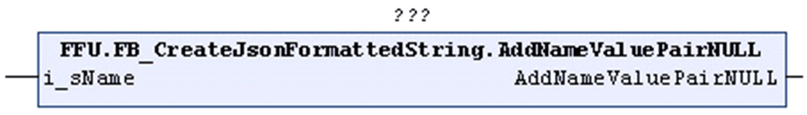

# AddNameValuePairNull (Method)

## Overview

|  |  |
| --- | --- |
| Type: | Method |
| Available as of: | V1.2.0.3 |



## Functional Description

Adds a name/value pair to the STRING that is being processed with the value being the literal name token `null`.

The return value is TRUE if the function was executed successfully. Evaluate the property `Result`, in case the return value is FALSE.

Unsuccessful execution of the method can have the following causes:

| Possible Cause | Effect |
| --- | --- |
| The maximum length of the present STRING is reached. | The STRING remains unchanged. |

## Interface

| Input | Data type | Description |
| --- | --- | --- |
| i\_sName | STRING(`GPL.Gc_uiJsonMaxLengthOfName`) | Specifies the name of the name/value pair to be added.  The quotation marks surrounding the `<name>` must not be specified explicitly, they are implicitly added by the method. |

## Example

Calling the method AddNameValuePairNull adds the text marked in bold in the example to the STRING:

```
{"Key":1,"<name>":null}
```

`<name>` corresponds to the value specified with the input i\_sName of the method.

EIO0000002785.06