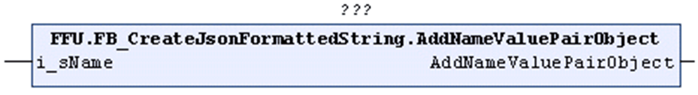

# AddNameValuePairObject (Method)

## Overview

|  |  |
| --- | --- |
| Type: | Method |
| Available as of: | V1.2.0.3 |



## Functional Description

Adds a name/value pair to the STRING that is being processed with the value being of type object.

After the method AddNameValuePairObject has been called, the object which represents the value that corresponds to the specified name is open.

Unsuccessful execution of the method can have the following causes:

| Possible Cause | Effect |
| --- | --- |
| The maximum length of the present STRING is reached. | The STRING remains unchanged. |
| The maximum number of levels is reached for the present STRING. | The STRING remains unchanged. |

## Interface

| Input | Data type | Description |
| --- | --- | --- |
| i\_sName | STRING(`GPL.Gc_uiJsonMaxLengthOfName`) | Specifies the name of the name/value pair to be added.  The quotation marks surrounding the `<name>` must not be specified explicitly, they are implicitly added by the method. |

## Example

Calling the method AddNameValuePairObject adds the text marked in bold in the example to the STRING:

```
{"Key":1,"<name>":{}
```

`<name>` corresponds to the value specified with the input i\_sName of the method.

EIO0000002785.06