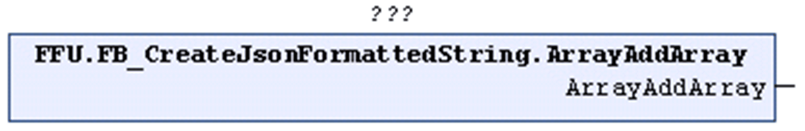

# ArrayAddArray (Method)

## Overview

|  |  |
| --- | --- |
| Type: | Method |
| Available as of: | V1.2.0.3 |



## Functional Description

Opens an ARRAY within an open ARRAY in the STRING that is being processed.

The return value is TRUE if the function was executed successfully. Evaluate the property `Result`, in case the return value is FALSE.

Unsuccessful execution of the method can have the following causes:

| Possible Cause | Effect |
| --- | --- |
| The present STRING does not contain an open ARRAY. | The STRING remains unchanged. |
| The maximum length of the present STRING is reached. | The STRING remains unchanged. |
| The maximum number of levels is reached for the present STRING. | The STRING remains unchanged. |

## Example

Calling the method ArrayAddArray adds the left square bracket, marked in bold in the example, to the STRING:

```
{"Array":[[}
```

EIO0000002785.06