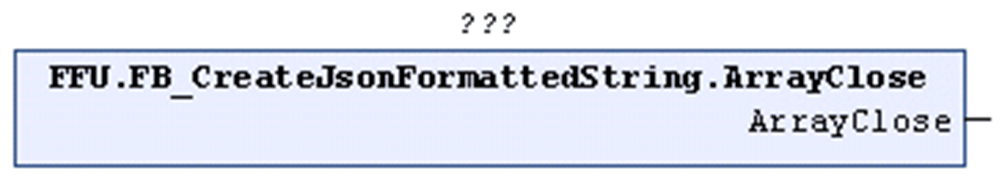

# ArrayClose (Method)

## Overview

|  |  |
| --- | --- |
| Type: | Method |
| Available as of: | V1.2.0.3 |



## Functional Description

Inserts a right square bracket before the last right curly bracket of the STRING that is being processed. According to the definition of the JSON syntax, the right square bracket indicates the end of an ARRAY. After the method ArrayClose has been called, the ARRAY is closed and no more values can be added to the corresponding ARRAY.

The return value is TRUE if the function was executed successfully. Evaluate the property `Result`, in case the return value is FALSE.

Unsuccessful execution of the method can have the following causes:

| Possible Cause | Effect |
| --- | --- |
| The present STRING does not contain an open ARRAY. | The STRING remains unchanged. |
| The maximum length of the present STRING is reached. | The STRING remains unchanged. |

## Example

Calling the method ArrayClose adds the right square bracket, marked in bold in the example, to the STRING:

```
{"Array":[1,2,3]}
```

EIO0000002785.06