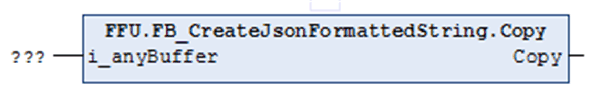

# Copy (Method)

## Overview

|  |  |
| --- | --- |
| Type: | Method |
| Available as of: | V1.2.0.3 |

## Functional Description

Copies the present JSON-formatted STRING to the specified buffer in the application.

The return value is of data type UDINT and indicates the number of bytes that have been copied to the specified buffer.

Evaluate the property Result, in case the return value is `0`. If the size of the specified buffer is less than the length of the present JSON-formatted STRING, no data is copied.

## Interface

| Input | Data type | Description |
| --- | --- | --- |
| i\_anyBuffer | ANY | Buffer provided by the application in which the data shall be copied. Data types ARRAY and STRING of appropriate size are supported. |

EIO0000002785.06