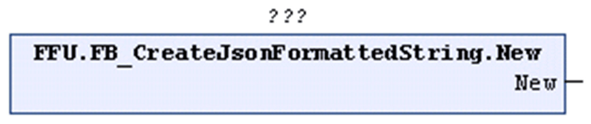

# New (Method)

## Overview

|  |  |
| --- | --- |
| Type: | Method |
| Available as of: | V1.2.0.3 |



## Functional Description

Creates a new STRING that contains a single pair of curly brackets `{}`.

When you call the method New, an existing STRING is overwritten.

The return value is TRUE if the function was executed successfully. Evaluate the property `Result`, in case the return value is FALSE.

## Example

Calling the method New creates the following STRING:

```
{}
```

EIO0000002785.06