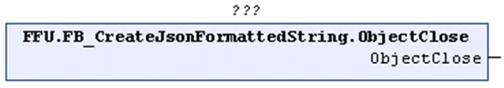

# ObjectClose (Method)

## Overview

|  |  |
| --- | --- |
| Type: | Method |
| Available as of: | V1.2.0.3 |



## Functional Description

Inserts a right curly bracket before the last right curly bracket of the STRING that is being processed. According to the definition of the JSON syntax, the right curly bracket indicates the end of an object. After the method ObjectClose has been called, the corresponding object is closed and no more name/value pairs can be added.

The return value is TRUE if the function was executed successfully. Evaluate the property `Result`, in case the return value is FALSE.

Unsuccessful execution of the method can have the following causes:

| Possible Cause | Effect |
| --- | --- |
| The present STRING does not contain an open object. | The STRING remains unchanged. |
| The maximum length of the present STRING is reached. | The STRING remains unchanged. |

## Example

Calling the method ObjectClose adds the right curly bracket, marked in bold in the example, to the STRING:

```
{"Key":1,"Object":{"ID":1, "Version":"5.0"}}
```

EIO0000002785.06