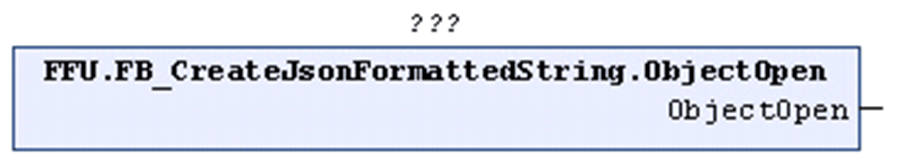

# ObjectOpen (Method)

## Overview

|  |  |
| --- | --- |
| Type: | Method |
| Available as of: | V1.2.0.3 |



## Functional Description

Inserts a left curly bracket to an open ARRAY before the last right curly bracket of the STRING that is being processed. According to the definition of the JSON syntax, the left curly bracket indicates the start of an object.

The return value is TRUE if the function was executed successfully. Evaluate the property `Result`, in case the return value is FALSE.

Unsuccessful execution of the method can have the following causes:

| Possible Cause | Effect |
| --- | --- |
| The maximum length of the present STRING is reached. | The STRING remains unchanged. |
| The maximum number of levels is reached for the present STRING. | The STRING remains unchanged. |

## Example

Calling the method ObjectOpen adds the left curly bracket, marked in bold in the example, to the STRING:

```
{"Array":[{}
```

EIO0000002785.06