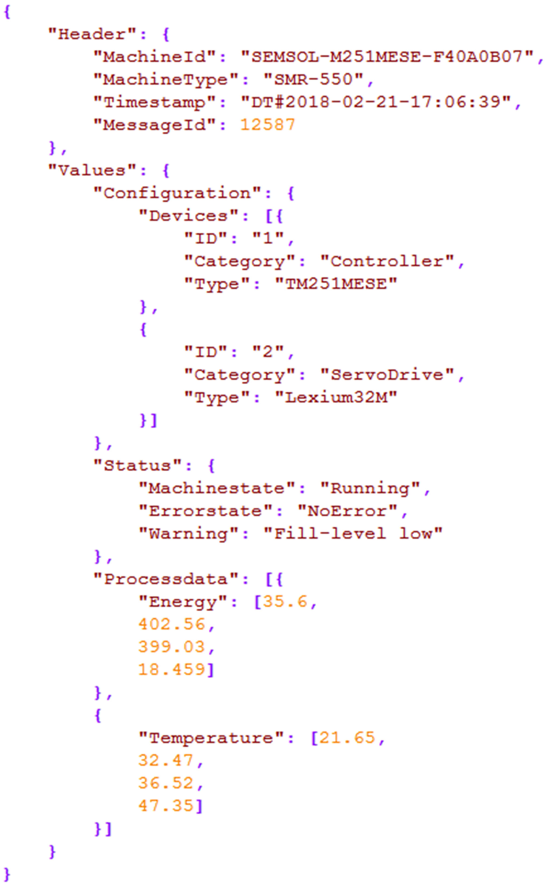

# FB\_CreateJsonFormattedString Example

## Overview

The following example shows how to build a text STRING in JSON format by using the function block FB\_CreateJsonFormattedString. After the text STRING has been created, it is stored in a new file on the file system of the controller by using the function block FB\_WriteFile.

## Example Program

```
//JSON Example - Declaration Part
PROGRAM SR_Main
VAR
    xStart : BOOL;
    xReset : BOOL;
    etResult : FFU.ET_Result;
    xJsonStringInvalid : BOOL;
    xProcessCompleted : BOOL;
    sResultMsg : STRING(80):= 'Ready for start';
    xErrorWriteFile : BOOL;	
    dtTimestamp : DATE_AND_TIME;
    udiMessageId : UDINT := 12587;
    rTotalEnergy : REAL	:= 35.6;
    rMaxVoltage : REAL	:= 402.56;
    rLowVoltage : REAL	:= 399.03;
    rMaxCurrent : REAL	:= 18.459;
    rTemperatureSensor1 : REAL	:= 21.65;
    rTemperatureSensor2 : REAL	:= 32.47;
    rTemperatureSensor3 : REAL	:= 36.52;
    rTemperatureSensor4 : REAL	:= 47.35;
    iState : INT;
    xErr : BOOL;
    xStartOld : BOOL;
    udiResult : UDINT;
    sJsonString : STRING(FFU.GPL.Gc_udiJsonMaxLengthOfString);
    fbJson : FFU.FB_CreateJsonFormattedString;
    fbWriteFile : FFU.FB_WriteFile;
END_VAR
```

```
//JSON Example - Implementation Part
CASE iState OF
0 : //Idle
    IF xStart AND NOT xStartOld THEN
        iState := 10 ;
        xProcessCompleted := FALSE ;
    END_IF
    xStartOld := xStart ;
    xStart := FALSE ;

10 : //Prepare data
    dtTimestamp := DWORD_TO_DT ( SysTimeRtc.SysTimeRtcGet ( udiResult ) ) ; // get the RTC of the controller
    iState := 20 ;

20 : //Create String
    xErr := FALSE ;
    xErr S= NOT fbJson.New ( ) ;
    xErr S= NOT fbJson.AddNameValuePairObject ( 'Header' ) ;
    xErr S= NOT fbJson.AddNameValuePairString ( 'MachineId' , 'SEMSOL-M251MESE-F40A0B07' ) ;
    xErr S= NOT fbJson.AddNameValuePairString ( 'MachineType' , 'SMR-550' ) ;
    xErr S= NOT fbJson.AddNameValuePair ( 'Timestamp' , dtTimestamp ) ;
    xErr S= NOT fbJson.AddNameValuePair ( 'MessageId' , udiMessageId ) ;
    xErr S= NOT fbJson.ObjectClose ( ) ; // close object header'
    xErr S= NOT fbJson.AddNameValuePairObject ( 'Values' ) ;
    xErr S= NOT fbJson.AddNameValuePairObject ( 'Configuration' ) ;
    xErr S= NOT fbJson.AddNameValuePairArray ( 'Devices' ) ;
    xErr S= NOT fbJson.ObjectOpen ( ) ;
    xErr S= NOT fbJson.AddNameValuePairString ( 'ID' , '1' ) ;
    xErr S= NOT fbJson.AddNameValuePairString ( 'Category' , 'Controller' ) ;
    xErr S= NOT fbJson.AddNameValuePairString ( 'Type' , 'TM251MESE' ) ;
    xErr S= NOT fbJson.ObjectClose ( ) ;
    xErr S= NOT fbJson.ObjectOpen ( ) ;
    xErr S= NOT fbJson.AddNameValuePairString ( 'ID' , '2' ) ;
    xErr S= NOT fbJson.AddNameValuePairString ( 'Category' , 'ServoDrive' ) ;
    xErr S= NOT fbJson.AddNameValuePairString ( 'Type' , 'Lexium32M' ) ;
    xErr S= NOT fbJson.ObjectClose ( ) ;
    xErr S= NOT fbJson.ArrayClose ( ) ; // close array Devices
    xErr S= NOT fbJson.ObjectClose ( ) ; // close object Configuration
    xErr S= NOT fbJson.AddNameValuePairObject ( 'Status' ) ;
    xErr S= NOT fbJson.AddNameValuePairString ( 'Machinestate' , 'Running' ) ;
    xErr S= NOT fbJson.AddNameValuePairString ( 'Errorstate' , 'NoError' ) ;
    xErr S= NOT fbJson.AddNameValuePairString ( 'Warning' , 'Filllevel low' ) ;
    xErr S= NOT fbJson.ObjectClose ( ) ;
    xErr S= NOT fbJson.AddNameValuePairArray ( 'Processdata' ) ;
    xErr S= NOT fbJson.ObjectOpen ( ) ;
    xErr S= NOT fbJson.AddNameValuePairArray ( 'Energy' ) ;
    xErr S= NOT fbJson.ArrayAddValue ( rTotalEnergy ) ;
    xErr S= NOT fbJson.ArrayAddValue ( rMaxVoltage ) ;
    xErr S= NOT fbJson.ArrayAddValue ( rLowVoltage ) ;
    xErr S= NOT fbJson.ArrayAddValue ( rMaxCurrent ) ;
    xErr S= NOT fbJson.ArrayClose ( ) ;
    xErr S= NOT fbJson.ObjectClose ( ) ;
    xErr S= NOT fbJson.ObjectOpen ( ) ;
    xErr S= NOT fbJson.AddNameValuePairArray ( 'Temperature' ) ;
    xErr S= NOT fbJson.ArrayAddValue ( rTemperatureSensor1 ) ;
    xErr S= NOT fbJson.ArrayAddValue ( rTemperatureSensor2 ) ;
    xErr S= NOT fbJson.ArrayAddValue ( rTemperatureSensor3 ) ;
    xErr S= NOT fbJson.ArrayAddValue ( rTemperatureSensor4 ) ;
    xErr S= NOT fbJson.ArrayClose ( ) ;
    xErr S= NOT fbJson.ObjectClose ( ) ;
    xErr S= NOT fbJson.ArrayClose ( ) ; // close array Processdata
    xErr S= NOT fbJson.ObjectClose ( ) ; // close object Values

    // copy the string, not mandatory for the present processing but for presentation of the feature
    fbJson.Copy ( i_anyBuffer := sJsonString ) ;

    IF xErr OR NOT fbJson.IsJsonStringValid THEN
        iState := 100 ;
        xJsonStringInvalid := NOT fbJson.IsJsonStringValid ;
    ELSE
        iState := 30 ;
    END_IF

30 : //Start write file
    fbWriteFile (
        i_xExecute := TRUE ,
        i_sFilePath := 'MachineData.json' ,
        i_etModeFileOpen := FFU.ET_ModeFileOpen.CreatePlus ,
        i_timTimeout := ,
        i_pbyBuffer := fbJson.PointerToJsonString ,
        i_udiSize := fbJson.LengthOfJsonString ,
        q_xDone => ,
        q_xBusy => ,
        q_xError => ,
        q_etResult => ,
        q_sResultMsg => ,
        q_udiFileSize => ) ;

    iState := 40 ;

40 : // Wait for write file complete
    IF fbWriteFile.q_xDone THEN
        iState := 0 ;
        xProcessCompleted := TRUE ;
    ELSIF fbWriteFile.q_xError THEN
        iState := 100 ;
        xErrorWriteFile := TRUE ;
        etResult := fbWriteFile.q_etResult ;
        sResultMsg := fbWriteFile.q_sResultMsg ;
    END_IF

        fbWriteFile ( i_xExecute := ( iState = 40 ) ) ;

100 : //Error detected
    IF xReset THEN
        iState := 0 ;
        etResult := FFU.ET_Result.Idle ;
        sResultMsg := 'Ready for start' ;
        xJsonStringInvalid := FALSE ;
        xErrorWriteFile := FALSE ;
        xReset := FALSE ;
    END_IF
END_CASE
```

## Resulting JSON File



NOTE: The original text STRING does not contain any blank spaces or line breaks. The JSON structure displayed in the figure above has been automatically created when opening the file in an appropriate text editor supporting JSON format.

EIO0000002785.06