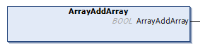

# ArrayAddArray (Method)

## Overview

|  |  |
| --- | --- |
| Type: | Method |
| Available as of: | V1.5.4.0 |



## Functional Description

This method is used for adding a new array in the sub hierarchy level as the selected element. The array is added as the first in the array of elements.

The return value of type BOOL indicates TRUE if the execution has been processed successfully.

The method has no inputs.

NOTE: By executing this method, a previously detected error indicated by the corresponding properties is reset. The selected element must be of type TypeArray.

## Example

Calling the method adds the element marked in bold in the example:

| Initial State | After Executing the Method |
| --- | --- |
| ``` { "SelectedArray" : ["ExistingValue"] } ``` | ``` { "SelectedArray": [[], "ExistingValue"] } ``` |

EIO0000002785.06