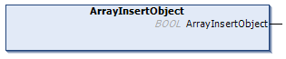

# ArrayInsertObject (Method)

## Overview

|  |  |
| --- | --- |
| Type: | Method |
| Available as of: | V1.5.4.0 |



## Functional Description

This method is used for inserting a new item in the hierarchy level as the selected element. The object is inserted as the next element from the selected element.

The return value of type BOOL indicates TRUE if the execution has been processed successfully.

The method has no inputs.

NOTE: By executing this method, a previously detected error indicated by the corresponding properties is reset. The parent element of the selected item must be of type TypeArray.

## Example

Calling the method adds the element marked in bold in the example:

| Initial State | After Executing the Method |
| --- | --- |
| ``` [ "SelectedValue", "ExistingValue" ] ``` | ``` [ "SelectedValue", {}, "ExistingValue" ] ``` |

EIO0000002785.06