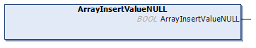

# ArrayInsertValueNULL (Method)

## Overview

|  |  |
| --- | --- |
| Type: | Method |
| Available as of: | V1.5.4.0 |



## Functional Description

This method is used for inserting a NULL value in the hierarchy level as the selected element. The NULL value is inserted as the next element from the selected element.

The return value of type BOOL indicates TRUE if the execution has been processed successfully.

The method has no inputs.

NOTE: By executing this method, a previously detected error indicated by the corresponding properties is reset.

NOTE: Inserting a new value places the item at the next position in the array. The parent element of the selected item must be of type TypeArray.

NOTE: If required, special characters are implicitly added by the method. This can increase the string length.

## Example

Calling the method adds the element marked in bold in the example:

| Initial State | After Executing the Method |
| --- | --- |
| ``` [ "SelectedValue", "ExistingValue" ] ``` | ``` [ "SelectedValue", NULL, "ExistingValue" ] ``` |

EIO0000002785.06