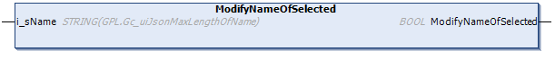

# ModifyNameOfSelected (Method)

## Overview

|  |  |
| --- | --- |
| Type: | Method |
| Available as of: | V1.5.4.0 |

## Functional Description

This method is used to modify the name of the selected item.

The return value of type BOOL indicates TRUE if the execution has been processed successfully.

If an error has been detected use the properties Result and ResultMsg to obtain the result of the method.

## Interface

| Input | Data type | Description |
| --- | --- | --- |
| i\_sName | STRING(`GPL.Gc_uiJsonMaxLengthOfName`) | Specifies the name.  The quotation marks surrounding the `<name>` must not be specified explicitly, they are implicitly added by the method. |

NOTE: By executing this method, a previously detected error indicated by the corresponding properties is reset. The parent element of the selected item must be of type TypeObject.

NOTE: If required, special characters are implicitly added by the method. This can increase the string length.

EIO0000002785.06