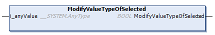

# ModifyValueTypeOfSelected (Method)

## Overview

|  |  |
| --- | --- |
| Type: | Method |
| Available as of: | V1.5.4.0 |

## Functional Description

This method is used to modify the value of the selected item.

The return value of type BOOL indicates TRUE if the execution has been processed successfully.

If an error has been detected use the properties Result and ResultMsg to obtain the result of the method.

## Interface

| Input | Data type | Description |
| --- | --- | --- |
| i\_anyValue | ANY\* | Specifies the value. |
| **(\*)** Supported data types are: BOOL, STRING, INT, UINT, DINT, UDINT, BYTE, WORD, DWORD, LWORD, REAL, LREAL, SINT, USINT, LINT, ULINT, TIME, LTIME, DATE\_AND\_TIME, DATE, and TOD. | | |

NOTE: By executing this method, a previously detected error indicated by the corresponding properties is reset.

NOTE: To complete this method successfully, an item of type TypeString / TypeNumber / TypeBoolean / TypeNull must be selected (refer to [ET\_JsonValueTyp](D-SE-0107955.html#D-SE-0107955)).

EIO0000002785.06