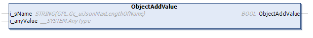

# ObjectAddValue (Method)

## Overview

|  |  |
| --- | --- |
| Type: | Method |
| Available as of: | V1.5.4.0 |



## Functional Description

This method is used to add a new name/value pair in the sub-hierarchy level as the selected element. The value is added as the first element in the array of elements.

The return value of type BOOL indicates TRUE if the execution has been processed successfully.

## Interface

| Input | Data type | Description |
| --- | --- | --- |
| i\_sName | STRING | Represents the name of the added JSON name/value pair. |
| i\_anyValue | ANY\* | Specifies the value to be added. |
| **(\*)** Supported data types are: BOOL, STRING, INT, UINT, DINT, UDINT, BYTE, WORD, DWORD, LWORD, REAL, LREAL, SINT, USINT, LINT, ULINT, TIME, LTIME, DATE\_AND\_TIME, DATE, and TOD. | | |

NOTE: By executing this method, a previously detected error indicated by the corresponding properties is reset. The selected element must be of type TypeObject. Refer to [ET\_JsonValueTyp](D-SE-0107955.html#D-SE-0107955).

NOTE: If required, special characters are implicitly added by the method. This can increase the string length.

## Example

Calling the method adds the element marked in bold in the example:

| Initial State | After Executing the Method |
| --- | --- |
| ``` { "SelectedObject" : {"ExistingName" : "ExistingValue"} } ``` | ``` { "SelectedObject" : {"NewName" : "NewValue","ExistingName" : "ExistingValue"} } ``` |

EIO0000002785.06