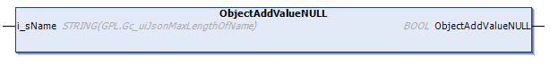

# ObjectAddValueNULL (Method)

## Overview

|  |  |
| --- | --- |
| Type: | Method |
| Available as of: | V1.5.4.0 |



## Functional Description

This method is used for adding a NULL value in the sub-hierarchy level as the selected element. The NULL value is added as the first element in the array of elements.

The return value of type BOOL indicates TRUE if the execution has been processed successfully.

## Interface

| Input | Data type | Description |
| --- | --- | --- |
| i\_sName | STRING | Represents the name of the added Json name-value pair. |

NOTE: By executing this method, a previously detected error indicated by the corresponding properties is reset. The selected element must be of type TypeObject.

## Example

Calling the method adds the element marked in bold in the example:

| Initial State | After Executing the Method |
| --- | --- |
| ``` { "SelectedObject" : {"ExistingName" : "ExistingValue"} } ``` | ``` { "SelectedObject" : {"NewName" : NULL,"ExistingName" : "ExistingValue"} } ``` |

EIO0000002785.06