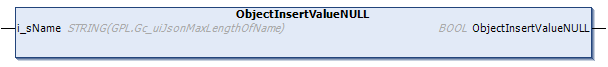

# ObjectInsertValueNULL (Method)

## Overview

|  |  |
| --- | --- |
| Type: | Method |
| Available as of: | V1.5.4.0 |



## Functional Description

This method is used to insert a NULL value in the hierarchy level as the selected element. The NULL value is inserted as the next element.

The return value of type BOOL indicates TRUE if the execution has been processed successfully.

## Interface

| Input | Data type | Description |
| --- | --- | --- |
| i\_sName | STRING | Represents the name of the added JSON name/value pair. |

NOTE: By executing this method, a previously detected error indicated by the corresponding properties is reset. The parent element of the selected element must be of type TypeObject. Refer to [ET\_JsonValueTyp](D-SE-0107955.html#D-SE-0107955).

## Example

Calling the method inserts the element marked in bold in the example:

| Initial State | After Executing the Method |
| --- | --- |
| ``` { "SelectedObject" : {}, "ExistingValue" : TRUE } ``` | ``` { "SelectedObject" : {}, "NewName" : NULL, "ExistingValue" : TRUE } ``` |

EIO0000002785.06