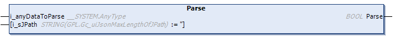

# Parse (Method)

## Overview

|  |  |
| --- | --- |
| Type: | Method |
| Available as of: | V1.4.15.0 |



## Functional Description

This method is used for parsing of JSON-formatted data synchronously. Depending on the data size the parsing can take several milliseconds. Consider this when configuring your task. Alternatively you can use the method ParseAsync(), which divides the parsing in single blocks per call to reduce the limit of the execution time of a single method call.

When the data has been parsed successfully, the root item is selected.

The return value of type BOOL indicates TRUE if the data was successfully parsed. Use the properties Result or ResultMsg to obtain the result of the method.

## Interface

| Input | Data type | Description |
| --- | --- | --- |
| i\_anyDataToParse | ANY | Assign a variable containing the JSON-formatted data.  Variables of type STRING or ARRAY OF BYTE are supported. |
| i\_sJPath | STRING [255] | Allows partly parsing JSON-formatted data: Only the items in the sub-hierarchy level as the element selected by the JPath expression are parsed.  To parse the complete data, assign a null string.  Also refer to the list of supported [JPath expressions](D-SE-0107965.html#D-SE-0107965__D-SE-0107965.11). |

NOTE: For performance reasons, the validity of the input parameters of the function blocks will be verified only in the first cycle after triggering the method execution. Do not modify these values while the parsing is in progress. By executing this method, a previously detected error indicated by the corresponding properties and the information related to previous parsing operation are reset. The function block performs a basic syntax verification of the data to parse. Ensure that the data is formed according to the JSON specification.

## Example

The following example indicates how to implement a synchronous parse process and to retrieve one value out of the parsed JSON-formatted string:

```
PROGRAM SR_Main_Sync
VAR
    xGetValueOutOfJsonString : BOOL;
    sCity : STRING;

    sJsonString : STRING[500] := '{"Library": "FileFormatUtility","Namespace": "FFU","Forward Compatible": true,"Supported Formats": ["JSON", "XML", "CSV"],"Company": "Schneider Electric","Address":{"Street": "Schneiderplatz","House Number": 1,"Postal Code": "97828","City": "Marktheidenfeld","Country": "Germany"}}';

    fbJsonUtilities : FFU.FB_JsonUtilities;
    etResult : FFU.ET_Result;
    sResultMsg : STRING;
END_VAR

IF xGetValueOutOfJsonString THEN
    xGetValueOutOfJsonString := FALSE;

    //Parse JSON formatted string
    IF NOT (fbJsonUtilities.Parse(i_anyDataToParse := sJsonString, i_sJPath := '')) THEN
              //Error handling for failed Parse process.
                 etResult := fbJsonUtilities.Result;
                 sResultMsg := fbJsonUtilities.ResultMs
        RETURN;
     END_IF

    //Select element containing requested value
    IF NOT(fbJsonUtilities.Select(i_sJPath := '.Address.City')) THEN
           //Error handling for failed Parse process.
            etResult := fbJsonUtilities.Result;
            sResultMsg := fbJsonUtilities.ResultMsg
        RETURN;
    END_IF

    //Get value of item
    sCity := fbJsonUtilities.ValueOfSelected;
    IF fbJsonUtilities.Error THEN
            //Error handling for failed Parse process.
            etResult := fbJsonUtilities.Result;
            sResultMsg := fbJsonUtilities.ResultMsg
        RETURN;
    END_IF
END_IF
```

EIO0000002785.06