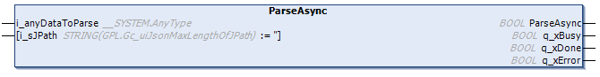

# ParseAsync (Method)

## Overview

|  |  |
| --- | --- |
| Type: | Method |
| Available as of: | V1.4.15.0 |



## Functional Description

This method is used for parsing of a JSON-formatted data asynchronously. The parsing of the data is done in several cycles. The block-size processed per cycle is specified by the global parameter GPL.Gc\_udiJsonMaxNumOfBytesPerCycle.

The parsing is completed if one of the outputs q\_xDone or q\_xError indicates TRUE. You must cyclically call the method while the output q\_xBusy is TRUE.

Depending on the data size and the specified block-size, the parsing can take several program cycles. While the parsing is in progress, no other method or property of the function block instance is processed.

If an error was detected use the properties Result and ResultMsg to obtain the result of the method.

## Interface

| Input | Data type | Description |
| --- | --- | --- |
| i\_anyDataToParse | ANY | Assign a variable containing the JSON-formatted data.  Variables of type STRING or ARRAY OF BYTE are supported. |
| i\_sJPath | STRING [255] | Allows partly parsing JSON-formatted data: Only the items in the sub-hierarchy level as the element selected by the JPath expression are parsed.  To parse the complete data, assign a null string.  Also refer to the list of supported [JPath expressions](D-SE-0107965.html#D-SE-0107965__D-SE-0107965.11). |

| Output | Data type | Description |
| --- | --- | --- |
| q\_xBusy | BOOL | If this output is set to TRUE, the method execution is in progress. |
| q\_xDone | BOOL | If this output is set to TRUE, the method execution has been completed successfully. |
| q\_xError | BOOL | If this output is set to TRUE, an error has been detected. For details, refer to q\_etResult and q\_etResultMsg. |

NOTE: For performance reasons, the validity of the input parameters of the function blocks will be verified only in the first cycle after triggering the method execution. Do not modify these values while the parsing is in progress. By executing this method, a previously detected error indicated by the corresponding properties and the information related to previous parsing operation are reset. The function block performs a basic syntax verification of the data to parse. Ensure that the data is formed according to the JSON specification.

## Example

Following example shows how to implement an asynchronous parse and to retrieve one value out of the parsed JSON-formatted string:

```
PROGRAM SR_Main_Async
VAR
    xGetValueOutOfJsonString : BOOL;
    sCity : STRING;

    sJsonString : STRING[500] := '{"Library": "FileFormatUtility","Namespace": "FFU","Forward Compatible": true,"Supported Formats": ["JSON", "XML", "CSV"],"Company": "Schneider Electric","Address":{"Street": "Schneiderplatz","House Number": 1,"Postal Code": "97828","City": "Marktheidenfeld","Country": "Germany"}}';

    fbJsonUtilities : FFU.FB_JsonUtilities;
    xBusy : BOOL;
    xDone : BOOL;
    xError : BOOL;
    etResult : FFU.ET_Result;
    sResultMsg : STRING;

END_VAR
```

```
IF xGetValueOutOfJsonString THEN
        //Parse JSON formatted string
        fbJsonUtilities.ParseAsync(i_anyDataToParse := sJsonString, i_sJPath := '', q_xBusy => xBusy, q_xDone => xDone, q_xError => xError);

        IF xDone THEN
            xGetValueOutOfJsonString := FALSE;

            //Select element containing requested value
            IF NOT(fbJsonUtilities.Select(i_sJPath := '.Address.City')) THEN
                   //Error handling for failed Parse process.
                    etResult := fbJsonUtilities.Result;
                    sResultMsg := fbJsonUtilities.ResultMsg
                RETURN;
            END_IF

            //Get value of item
            sCity := fbJsonUtilities.ValueOfSelected;
            IF fbJsonUtilities.Error THEN
                //Error handling for failed Parse process.
                 etResult := fbJsonUtilities.Result;
                 sResultMsg := fbJsonUtilities.ResultMsg
                RETURN;
            END_IF

    ELSIF xError THEN
          xGetValueOutOfJsonString := FALSE;
          //Error handling for failed Parse process.
          etResult := fbJsonUtilities.Result;
          sResultMsg := fbJsonUtilities.ResultMsg
            RETURN;
    END_IF
END_IF
```

EIO0000002785.06