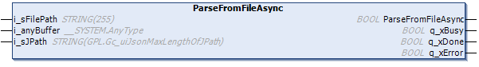

# ParseFromFileAsync (Method)

## Overview

|  |  |
| --- | --- |
| Type: | Method |
| Available as of: | V1.5.4.0 |

## Functional Description

This method is used for asynchronous parsing of a JSON-formatted file located on the file system of the controller. The parsing can take several program cycles. While the parsing is in progress, no other method or property of the function block instance is processed. The number of bytes processed in one cycle is determined by the global parameter GPL.Gc\_udiJsonMaxNumOfBytesPerCycle. After successful execution of the method, the root item is selected.

If an error was detected use the properties Result and ResultMsg to obtain the result of the method.

The parsing is completed if one of the outputs q\_xDone or q\_xError indicates TRUE. You must cyclically call the method while the output q\_xBusy is TRUE.

## Interface

| Input | Data type | Description |
| --- | --- | --- |
| i\_sFilePath | STRING [255] | The path to the JSON file that shall be read.  If a file name is specified without file extension, the function block adds the extension .json. |
| i\_anyBuffer | ANY | Address of the variable containing the JSON-formatted data allocated in the application.  Variables of type STRING or ARRAY OF BYTE are supported. |
| i\_sJPath | STRING [GPL.Gc\_uiJsonMaxLengthOfJPath] | Allows partly parsing JSON-formatted data: Only the items in the sub-hierarchy level as the element selected by the JPath expression are parsed.  To parse the complete data, assign a null string.  Also refer to the list of supported [JPath expressions](D-SE-0107965.html#D-SE-0107965__D-SE-0107965.11). |

| Output | Data type | Description |
| --- | --- | --- |
| q\_xBusy | BOOL | If this output is set to TRUE, the method execution is in progress. |
| q\_xDone | BOOL | If this output is set to TRUE, the method execution has been completed successfully. |
| q\_xError | BOOL | If this output is set to TRUE, an error has been detected. For details, refer to q\_etResult and q\_etResultMsg. |

NOTE: For performance reasons, the validity of the input parameters of the function blocks will be verified only in the first cycle after triggering the method execution. Do not modify these values while the parsing is in progress. By executing this method, a previously detected error indicated by the corresponding properties and the information related to previous parsing operation are reset. The function block performs a basic syntax verification of the data to parse. Ensure that the data is formed according to the JSON specification.

EIO0000002785.06