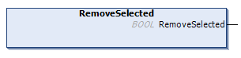

# RemoveSelected (Method)

## Overview

|  |  |
| --- | --- |
| Type: | Method |
| Available as of: | V1.5.4.0 |



## Functional Description

This method is used to remove a selected element including its child elements.

The return value of type BOOL indicates TRUE if the execution has been processed successfully.

The method has no inputs.

NOTE: When the selected item has been removed, its parent element is selected.

## Example

Calling the method removes the element as indicated in the example:

| Initial State | After Executing the Method |
| --- | --- |
| ``` { "SelectedArray" : ["ExistingValue1", "ExistingValue2"], "ExistingValue" : TRUE } ``` | ``` { "ExistingValue": TRUE } ``` |

EIO0000002785.06