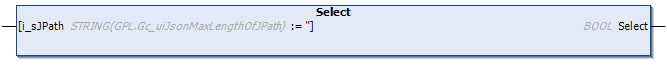

# Select (Method)

## Overview

|  |  |
| --- | --- |
| Type: | Method |
| Available as of: | V1.4.15.0 |



## Functional Description

This method is used to select the specified item from the parsed JSON-formatted data. Based on the selected item, further methods can be executed.

The element is specified using an JPath expression. If the JPath expression matches several elements, the first matching item is selected. If a null string is assigned to the input i\_sJPath, the root item is selected.

On each call, the search of the specified item is started from the beginning of the parsed data. That is, using the same JPath expression always results in the same element being selected.

The return value of type BOOL indicates TRUE if an element was successfully selected. If an error has been detected use the properties Result and ResultMsg to obtain the result of the method.

In case the requested item could not be selected, the previously selected item remains selected.

## Interface

| Input | Data type | Description |
| --- | --- | --- |
| i\_sJPath | STRING [255] | JPath expression to specify the item to be selected. If a null string is assigned, the root item is selected. |

NOTE: By executing this method, a previously detected error indicated by the corresponding properties is reset.

## JPath Expressions

Use the syntax of the JPath language to specify the item to be selected.

The table lists the supported JPath expressions:

| JPath expression | Description |
| --- | --- |
| `.<item name>`  `<item name>`  `.[<item name>]`  `[<item name>]` | Selects the first item with the specified name at the first level. |
| `.<item name>.<item name>`  `.[<item name>].[<item name>]`  `[<item name>][<item name>]` | Selects the first item matching the specified absolute path. |
| `.<parent name>.<item name>[<n>]`  `.<parent name>.<item name>.[<n>]` | Selects the first array element matching the specified absolute path. `<n>` specifies the index (zero based) of the element in the array. |
| `.<parent name>.<item name>.[<n>].<item name>`  `.<parent name>.<item name>.[<n>].[<item name>]` | Selects the child item of the first array element matching the specified absolute path. `<n>` specifies the index (zero based) of the element in the array. |

The following example shows how to use the JPath expression to select an item out of a JSON-formatted data:

| JPath expression | Parsed JSON data |
| --- | --- |
| ``` .Library ------------->   .Supported Formats[1]->     .Address -------------> .Address.Street ------> ``` | ``` {    "Library": "FileFormatUtility",   "Namespace": "FFU",   "Forward Compatible": true,   "Supported Formats": [                "JSON",                "XML",                "CSV"],   "Company": "Schneider Electric",   "Address":  {                "Street": "Schneiderplatz",                "House Number": 1,                "Postal Code": "97828",                "City": "Marktheidenfeld",                "Country": "Germany"   } } ``` |

EIO0000002785.06