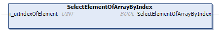

# SelectElementOfArrayByIndex (Method)

## Overview

|  |  |
| --- | --- |
| Type: | Method |
| Available as of: | V1.4.15.0 |

## Functional Description

This method is used for selecting an element of the selected array by index (zero based).

The return value of type BOOL indicates if execution has been processed successfully. In case the return value is FALSE, refer to the properties Result and ResultMsg for details.

An item with value of type TypeArray must be selected prior to executing the method. In case the requested item could not be selected, the previously selected item remains selected.

NOTE: By executing this method, a previously detected error indicated by the corresponding properties is reset.

## Interface

| Input | Data type | Description |
| --- | --- | --- |
| i\_uiIndexOfElement | UINT | Index of the element inside the selected array starting with 0. |

EIO0000002785.06