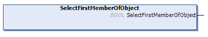

# SelectFirstMemberOfObject (Method)

## Overview

|  |  |
| --- | --- |
| Type: | Method |
| Available as of: | V1.4.15.0 |

## Functional Description

This method is used to select the first member of the selected item of type TypeObject.

The return value of type BOOL indicates TRUE if an element was successfully selected. If an error has been detected use the properties Result and ResultMsg to obtain the result of the method. In case the requested item could not be selected, the previously selected item remains selected.

The method has no inputs.

NOTE: By executing this method, a previously detected error indicated by the corresponding properties is reset.

EIO0000002785.06