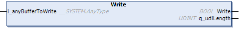

# Write (Method)

## Overview

|  |  |
| --- | --- |
| Type: | Method |
| Available as of: | V1.5.4.0 |



## Functional Description

This method is used for synchronous creating and writing of JSON-formatted data. Depending on the data size, the writing can take several milliseconds. Consider this when configuring your task. Alternatively, you can use the method WriteAsync which divides the writing in single blocks per call to reduce the execution time of a single method call. Prerequisite is that the data has been parsed successfully. Refer to [Parse (Method)](D-SE-0107961.html#D-SE-0107961).

NOTE: If you write a partly parsed JSON string back to the root buffer, the unparsed part of the JSON string is lost.

The return value of type BOOL indicates TRUE if the method has been completed successfully. If the return value is FALSE, refer to the properties Result and ResultMsg for details.

## Interface

| Input | Data type | Description |
| --- | --- | --- |
| i\_anyBufferToWrite | ANY | Buffer allocated in the application. |

NOTE: By executing this method, a previously detected error indicated by the corresponding properties and the information related to previous writing operation are reset. During the execution of the operation a basic syntax check of the data to write is performed.

## Example

The following example indicates how to implement a parse process, a modification of one value out of the parsed JSON-formatted string, and a synchronous writing:

```
PROGRAM SR_Main_Sync
VAR
    iState : INT;

    xWriteModifiedJsonString : BOOL;
    sCountry : STRING := 'Deutschland';

    sJsonString : STRING[500] := '{"Library": "FileFormatUtility","Namespace": "FFU","Forward Compatible": true,"Supported Formats": ["JSON", "XML", "CSV"],"Company": "Schneider Electric","Address":{"Street": "Schneiderplatz","House Number": 1,"Postal Code": "97828","City": "Marktheidenfeld","Country": "Germany"}}'

    fbJsonUtilities : FFU.FB_JsonUtilities;
    xBusy : BOOL;
    etResult : FFU.ET_Result;
    sResultMsg : STRING;
END_VAR
```

```
IF xWriteModifiedJsonString THEN
    xWriteModifiedJsonString := FALSE;

    //Parse JSON formatted string
    IF NOT (fbJsonUtilities.Parse(i_anyDataToParse := sJsonString, i_sJPath := '')) THEN
        //Error handling for failed Parse process.
    etResult := fbJsonUtilities.Result;
    sResultMsg :=  fbJsonUtilities.ResultMsg
        RETURN;
     END_IF

    //Select element containing requested value
    IF NOT (fbJsonUtilities.Select(i_sJPath := '.Address.Country')) THEN
        //Error handling for failed Parse process.
    etResult := fbJsonUtilities.Result;
    sResultMsg :=  fbJsonUtilities.ResultMsg
        RETURN;
     END_IF

    //Modify value of item
    IF NOT (fbJsonUtilities.ModifyValueTypeOfSelected(i_anyValue := sCountry)) THEN
        //Error handling for failed Modify process.
    etResult := fbJsonUtilities.Result;
    sResultMsg :=  fbJsonUtilities.ResultMsg
        RETURN;
     END_IF

    //Write JSON formatted string
    IF NOT (fbJsonUtilities.Write(i_anyBufferToWrite := sJsonString)) THEN
        //Error handling for failed Write process.
    etResult := fbJsonUtilities.Result;
    sResultMsg :=  fbJsonUtilities.ResultMsg
        RETURN;
     END_IF
END_IF
```

EIO0000002785.06