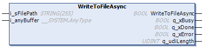

# WriteToFileAsync (Method)

## Overview

|  |  |
| --- | --- |
| Type: | Method |
| Available as of: | V1.5.4.0 |



## Functional Description

This method is used for asynchronous creating and writing of JSON-formatted data to a file located on the file system of the controller. The execution can take several cycles. Prerequisite is that the data has been parsed successfully. Refer to [Parse (Method)](D-SE-0107961.html#D-SE-0107961). While writing is in progress, no further methods or properties of the function block can be processed.

The number of bytes processed in one cycle is the minimum size between the input of i\_anyBuffer and the global parameter GPL.Gc\_udiJsonMaxNumOfBytesPerCycle.

The diagnostic outputs indicate if the execution has been processed successfully. If an error has been detected refer to the properties Result and ResultMsg for details.

NOTE: If you write a partly parsed JSON string back to the root file, the unparsed part of the JSON string is lost.

## Interface

| Input | Data type | Description |
| --- | --- | --- |
| i\_sFilePath | STRING[255] | File path of the JSON file that will be written. If a file name is specified without file extension, the function block adds the extension .json.  NOTE: The maximum path length of 255 bytes includes the file extension. |
| i\_anyBuffer | ANY | Address of the temporary buffer allocated in the application used to write the data to file. |

| Output | Data type | Description |
| --- | --- | --- |
| q\_xBusy | BOOL | If this output is set to TRUE, the method execution is in progress. |
| q\_xDone | BOOL | If this output is set to TRUE, the method execution has been completed successfully. |
| q\_xError | BOOL | If this output is set to TRUE, an error has been detected. For details, refer to q\_etResult and q\_etResultMsg. |
| q\_udiLength | UDINT | Indicates the file size in bytes. |

NOTE: For performance reasons the validity of the input parameters of the function blocks is verified only in the first cycle after triggering the method execution. Do not modify these values while the function block is executed. By executing this method, a previously detected error indicated by the corresponding properties and information related to previous writing operation is reset.

## Example

The following example indicates how to implement a parse process, a modification of one value out of the parsed JSON-formatted string, and an asynchronous writing to a file:

```
PROGRAM SR_Main_Async
VAR
    iState : INT;

    xWriteModifiedJsonStringToFile : BOOL;
    sCountry : STRING := 'Deutschland';

    sJsonString : STRING[500] := '{"Library": "FileFormatUtility","Namespace": "FFU","Forward Compatible": true,"Supported Formats": ["JSON", "XML", "CSV"],"Company": "Schneider Electric","Address":{"Street": "Schneiderplatz","House Number": 1,"Postal Code": "97828","City": "Marktheidenfeld","Country": "Germany"}}'

    fbJsonUtilities : FFU.FB_JsonUtilities;
    abyTempBuffer : ARRAY[[0..254] OF BYTE;
    xBusy : BOOL;
    etResult : FFU.ET_Result;
    sResultMsg : STRING;
END_VAR
```

```
CASE iState OF
    0:

      IF xWriteModifiedJsonString THEN
        xWriteModifiedJsonString := FALSE;

        //Parse JSON formatted string
        IF NOT (fbJsonUtilities.Parse(i_anyDataToParse := sJsonString, i_sJPath := '')) THEN
          //Error handling for failed Parse process.
    etResult := fbJsonUtilities.Result;
    sResultMsg :=  fbJsonUtilities.ResultMsg
          RETURN;
      END_IF

        //Select element containing requested value
        IF NOT (fbJsonUtilities.Select(i_sJPath := '.Address.Country')) THEN
          //Error handling for failed Parse process.
    etResult := fbJsonUtilities.Result;
    sResultMsg :=  fbJsonUtilities.ResultMsg
          RETURN;
      END_IF

        //Modify value of item
        IF NOT ((fbJsonUtilities.ModifyValueTypeOfSelected(i_anyValue := sCountry)) THEN
          //Error handling for failed Modify process.
    etResult := fbJsonUtilities.Result;
    sResultMsg :=  fbJsonUtilities.ResultMsg
          RETURN;
      END_IF

      iState := 10;
    END_IF

    10:
      //Write modified JSON formatted string to a file
      (fbJsonUtilities.WriteToFileAsync(i_sFilePath:='./myfiles/FileName.json',i_anyBufferToWrite := sJsonString, q_xBusy => xBusy);
      IF NOT xBusy THEN
          IF fbJsonUtilities.Error THEN
              //Error handling for failed Write process.
    etResult := fbJsonUtilities.Result;
    sResultMsg :=  fbJsonUtilities.ResultMsg
          END_IF

          iState := 0;
    END_IF
END_CASE
```

EIO0000002785.06