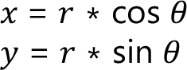
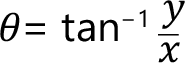

# FC\_Atan2

## Overview

|  |  |
| --- | --- |
| Type: | Function |
| Available as of: | V1.1.0.0 |

## Description

Four quadrant inverse tangent.

Given:

The function returns a value *θ* in the range [*-π, +π*] that is evaluated as:

The function is not defined for a zero value of both *x* and *y*.

## Interface

| Input | Data type | Description |
| --- | --- | --- |
| i\_lrY | LREAL | Numerator of the argument of the arctangent function. |
| i\_lrX | LREAL | Denominator of the argument of the arctangent function. |

| Output | Data type | Description |
| --- | --- | --- |
| q\_xError | BOOL | If this output is set to TRUE, an error has been detected. For details, refer to q\_etResult and q\_etResultMsg. |
| q\_etResult | [ET\_Result](ET_Result-GeneralInformation-0C182C26.html#ET_Result-GeneralInformation-0C182C26) | Provides diagnostic and status information as a numeric value. |
| q\_sResultMsg | STRING[80] | Provides additional diagnostic and status information as a text message. |

## Return Value

| Data type | Description |
| --- | --- |
| LREAL | The function returns an inverse tangent value*θ* in the range [*-π, +π*]. |

## Diagnostic Messages

| q\_xError | q\_etResult | Enumeration value | Description |
| --- | --- | --- | --- |
| FALSE | Ok | 0 | Success |
| TRUE | NullInputs | 1001 | All inputs are zero. |

## NullInputs

|  |  |
| --- | --- |
| Enumeration name: | NullInputs |
| Enumeration value: | 1001 |
| Description: | All inputs are zero. |

| Cause | Solution |
| --- | --- |
| The values i\_lrX and i\_lrY are zero. | Make sure that at least one of the inputs is not zero. |

## Ok

|  |  |
| --- | --- |
| Enumeration name: | Ok |
| Enumeration value: | 0 |
| Description: | Success |

EIO0000002815.02