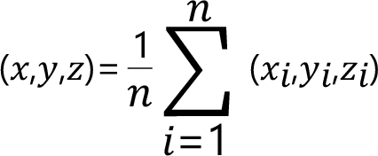

# FC\_AveragePointFromPoints

## Overview

|  |  |
| --- | --- |
| Type: | Function |
| Available as of: | V1.1.0.0 |

## Description

Evaluates the average point from a list of provided points. The function returns the Cartesian coordinates of this point.

## Interface

| Input | Data type | Description |
| --- | --- | --- |
| i\_astPoints | ARRAY [1...Gc\_udiMaxNumberOfPoints] OF [ST\_Vector3D](ST_Vector3D-GeneralInformation-0FB413FF.html#ST_Vector3D-GeneralInformation-0FB413FF) | List of points to consider. |
| i\_udiNumberOfPoints | UDINT | Number of provided points. |

| Output | Data type | Description |
| --- | --- | --- |
| q\_xError | BOOL | If this output is set to TRUE, an error has been detected. For details, refer to q\_etResult and q\_etResultMsg. |
| q\_etResult | [ET\_Result](ET_Result-GeneralInformation-0C182C26.html#ET_Result-GeneralInformation-0C182C26) | Provides diagnostic and status information as a numeric value. |
| q\_sResultMsg | STRING[80] | Provides additional diagnostic and status information as a text message. |

## Return Value

| Data type | Description |
| --- | --- |
| [ST\_Vector3D](ST_Vector3D-GeneralInformation-0FB413FF.html#ST_Vector3D-GeneralInformation-0FB413FF) | The function returns the coordinates of the average point evaluated from the list of provided points. |

## Diagnostic Messages

| q\_xError | q\_etResult | Enumeration value | Description |
| --- | --- | --- | --- |
| FALSE | Ok | 0 | Success |
| FALSE | OnlyOnePointProvided | 1014 | The input pi\_udiNumberOfPoints  is set to 1 and only one point was provided. The return value (point) is equal to the first point in the list. |
| TRUE | NumberOfPointsInvalid | 1002 | An invalid number of points has been provided. |

## NumberOfPointsInvalid

|  |  |
| --- | --- |
| Enumeration name: | NumberOfPointsInvalid |
| Enumeration value: | 1002 |
| Description: | An invalid number of points has been provided. |

| Cause | Solution |
| --- | --- |
| i\_udiNumberOfPoints is not within in the range [1, Gc\_udiMaxNumberOfPoints] | Verify that 1 ≤i\_udiNumberOfPoints ≤Gc\_udiMaxNumberOfPoints. |

## Ok

|  |  |
| --- | --- |
| Enumeration name: | Ok |
| Enumeration value: | 0 |
| Description: | Success |

## OnlyOnePointProvided

|  |  |
| --- | --- |
| Enumeration name: | OnlyOnePointProvided |
| Enumeration value: | 1014 |
| Description: | The input pi\_udiNumberOfPoints  is set to 1 and only one point was provided. The return value (point) is equal to the first point in the list. |

EIO0000002815.02