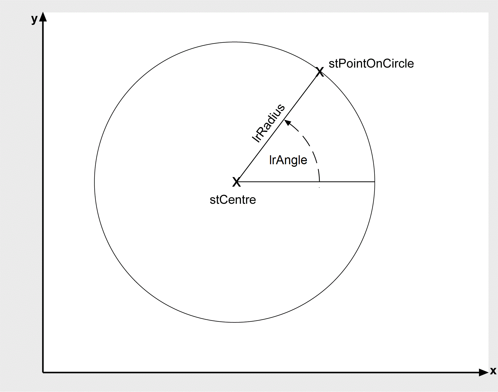

# FC\_Circle2DAngleToCartesian

## Overview

|  |  |
| --- | --- |
| Type: | Function |
| Available as of: | V1.1.0.0 |

## Description

This function calculates the coordinates of the point on the circumference of the circle i\_stCircle, which has the direction angle i\_lrAngle. The direction angle is measured counter-clockwise in degrees. 0° corresponds to the positive X direction (see the following graphic).

## Interface

| Input | Data type | Description |
| --- | --- | --- |
| i\_stCircle | [ST\_Circle2D](ST_Circle2D-GeneralInformation-0C02751F.html#ST_Circle2D-GeneralInformation-0C02751F) | Circle on which the point to be calculated is located. |
| i\_lrAngle | LREAL | Direction angle of the point (in degrees, counter-clockwise in relation to the positive X direction). |

| Output | Data type | Description |
| --- | --- | --- |
| q\_xError | BOOL | If this output is set to TRUE, an error has been detected. For details, refer to q\_etResult and q\_etResultMsg. |
| q\_etResult | [ET\_Result](ET_Result-GeneralInformation-0C182C26.html#ET_Result-GeneralInformation-0C182C26) | Provides diagnostic and status information as a numeric value. |
| q\_sResultMsg | STRING[80] | Provides additional diagnostic and status information as a text message. |

## Return Value

| Data type | Description |
| --- | --- |
| [ST\_Vector2D](ST_Vector2D-GeneralInformation-0BFF6B0C.html#ST_Vector2D-GeneralInformation-0BFF6B0C) | Point on the circumference of the circle |

## Diagnostic Messages

| q\_xError | q\_etResult | Enumeration value | Description |
| --- | --- | --- | --- |
| FALSE | Ok | 0 | Success |
| TRUE | RadiusRangeCircle | 26 | The radius of the circle is outside the valid range. |

## Ok

|  |  |
| --- | --- |
| Enumeration name: | Ok |
| Enumeration value: | 0 |
| Description: | Success |

The intersections have been successfully calculated.

## RadiusRangeCircle

|  |  |
| --- | --- |
| Enumeration name: | RadiusRangeCircle |
| Enumeration value: | 26 |
| Description: | The radius of the circle is outside the valid range. |

| Cause | Solution |
| --- | --- |
| A value of less than zero has been set at the input i\_stCircle.lrRadius. | The radius of the circle must be zero or greater than zero. |

EIO0000002815.02